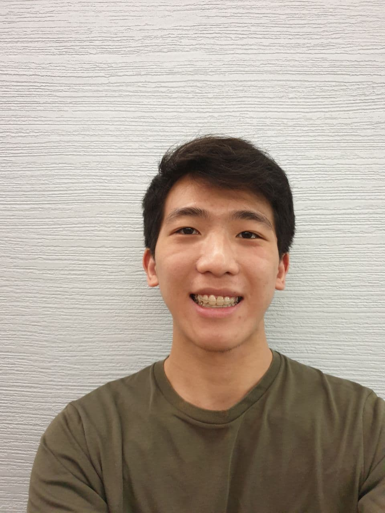
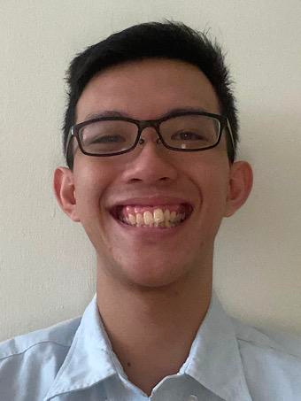
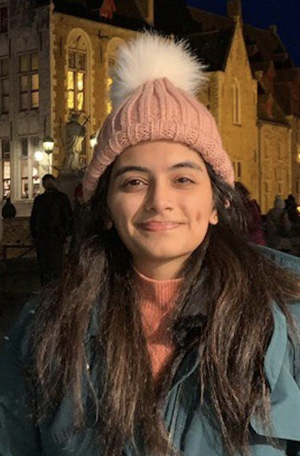

We are a team based in the [School of Computing, National University of Singapore](http://www.comp.nus.edu.sg).

# Project team

## Simon Julian Lauw

[[homepage](https://simonjulianl.github.io)]
[[github](https://github.com/simonjulianl)]
[[portfolio](team/simonjulianl.md)]

* Role: Team Lead
* Responsibilities: Deliverables and Deadlines

## Radian Krisno

[[github](http://github.com/radiankrisno)]
[[portfolio](team/radiankrisno.md)]

* Role: Developer
* Responsibilities: Program structure, Release manager

## Yap Yuhang

[[github](http://github.com/yyhangz)] [[portfolio](team/yyhangz.md)]

* Role: Developer
* Responsibilities: Code quality

## Ng Seng Leng

[[github](http://github.com/ngsengleng)]
[[portfolio](team/ngsengleng.md)]

* Role: Developer
* Responsibilities: Dev Ops + Threading

## Rama Venkatesh

[[github](http://github.com/ramaven)]
[[portfolio](team/ramaven.md)]

* Role: Developer
* Responsibilities: UI
