## **Introduction**

GoMedic is a **cross-platform desktop application written in Java and designed for doctors and medical residents to
manage contacts and patient details**. We aim for GoMedic to be used by someone who can type fast and take advantage of the
optimized features for Command Line Interface.

--------------------------------------------------------------------------------------------------------------------

## **Table of Contents**
* Table of Contents
{:toc}

--------------------------------------------------------------------------------------------------------------------

## **Acknowledgements**
* Project bootstrapped from: [SE-EDU Address Book 3](https://se-education.org/addressbook-level3/)
* Libraries used: [JavaFX](https://openjfx.io/), [Jackson](https://github.com/FasterXML/jackson)
  , [JUnit5](https://github.com/junit-team/junit5), [iTextPdf](https://itextpdf.com/en)

--------------------------------------------------------------------------------------------------------------------

## **About the Diagrams**

:information_source: **Note:** The lifeline for of all diagrams in this developer guide 
should end at the destroy marker (X) but due to a limitation of PlantUML, the lifeline reaches the end of diagram.

--------------------------------------------------------------------------------------------------------------------

## **Setting up, getting started**

Refer to the guide [_Setting up and getting started_](SettingUp.md).

--------------------------------------------------------------------------------------------------------------------

## **Design**

:bulb: **Tip:** The `.puml` files used to create diagrams in this document can be found in
the [diagrams](https://github.com/AY2122S1-CS2103T-T15-1/tp/tree/master/docs/diagrams/) folder. Refer to the [_PlantUML
Tutorial_ at se-edu/guides](https://se-education.org/guides/tutorials/plantUml.html) to learn how to create and edit
diagrams.

### Architecture

The ***Architecture Diagram*** given above explains the high-level design of the App.

Given below is a quick overview of main components and how they interact with each other.

**Main components of the architecture**

**`Main`** has two classes
called [`Main`](https://github.com/AY2122S1-CS2103T-T15-1/tp/tree/master/src/main/java/gomedic/Main.java)
and [`MainApp`](https://github.com/AY2122S1-CS2103T-T15-1/tp/tree/master/src/main/java/gomedic/MainApp.java). It
is responsible for,

* At app launch: Initializes the components in the correct sequence, and connects them up with each other.
* At shut down: Shuts down the components and invokes cleanup methods where necessary.

[**`Commons`**](#common-classes) represents a collection of classes used by multiple other components.

The rest of the App consists of four components.

* [**`UI`**](#ui-component): The UI of the App.
* [**`Logic`**](#logic-component): The command executor.
* [**`Model`**](#model-component): Holds the data of the App in memory.
* [**`Storage`**](#storage-component): Reads data from, and writes data to, the hard disk.

**How the architecture components interact with each other**

The *Sequence Diagram* below shows how the components interact with each other for the scenario where the user issues
the command `delete 1`.

Each of the four main components (also shown in the diagram above),

* defines its *API* in an `interface` with the same name as the Component.
* implements its functionality using a concrete `{Component Name}Manager` class (which follows the corresponding
  API `interface` mentioned in the previous point.

For example, the `Logic` component defines its API in the `Logic.java` interface and implements its functionality using
the `LogicManager.java` class which follows the `Logic` interface. Other components interact with a given component
through its interface rather than the concrete class (reason: to prevent outside component's being coupled to the
implementation of a component), as illustrated in the (partial) class diagram below.

The sections below give more details of each component.

### UI component

The **API** of this component is specified
in [`Ui.java`](https://github.com/AY2122S1-CS2103T-T15-1/tp/tree/master/src/main/java/gomedic/ui/Ui.java)

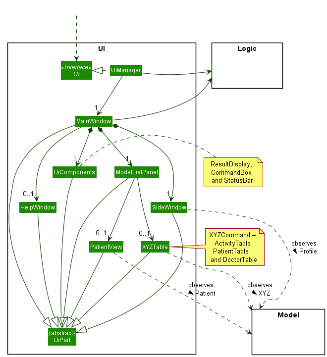

The UI consists of a `MainWindow` that is made up of many Ui components e.g.`CommandBox`, `ResultDisplay`, `SideWindow`
, `StatusBarFooter` etc. All these, including the `MainWindow`, inherit from the abstract `UiPart` class which captures
the commonalities between classes that represent parts of the visible GUI.

The `UI` component uses the JavaFx UI framework. The layout of these UI parts are defined in matching `.fxml` files that
are in the `src/main/resources/view` folder. For example, the layout of
the [`MainWindow`](https://github.com/AY2122S1-CS2103T-T15-1/tp/tree/master/src/main/java/gomedic/ui/MainWindow.java)
is specified
in [`MainWindow.fxml`](https://github.com/AY2122S1-CS2103T-T15-1/tp/tree/master/src/main/resources/view/MainWindow.fxml)

The `UI` component,

* executes user commands using the `Logic` component.
* keeps a reference to the `Logic` component, because the `UI` relies on the `Logic` to execute commands.
* listens for changes to `Model` activities, doctors and patients data so that the respective Ui table can be shown and can be updated with the modified data.
* depends on some classes in the `Model` component, as it displays `Doctor`, `Profile`, `Patient` and `Activities` object residing in the `Model`.

The original Figma design for the `UI` component can be found [here](https://www.figma.com/file/zqo6peKfu0Wxeay679eVq9/cs2103t-tp?node-id=0%3A1)

To display the correct table (i.e. `ActivityTable`, `PatientTable`, or `DoctorTable`) or `PatientView` page to be shown in the `MainWindow`. 
The `MainWindow` object also listens to the `ModelBeingShown` stored in the `Model` component. 

The following *Sequence Diagram* illustrates how the `UI` component interacted with other components to show 
the correct model to the user after the user enters `list t/patient` command.  

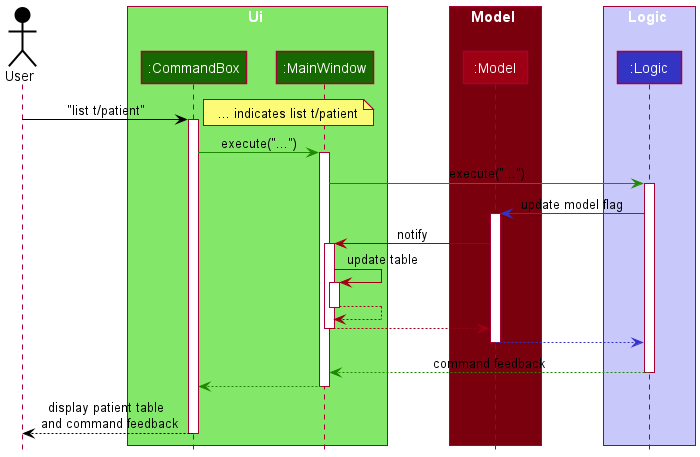

:information_source: 
**Note:** GoMedic implements Observer Pattern using `ObservableList` and `ObservableValue` provided by the `JavaFX` framework to update the Ui

### Logic component

**API** : [`Logic.java`](https://github.com/AY2122S1-CS2103T-T15-1/tp/tree/master/src/main/java/gomedic/logic/Logic.java)

Here's a (partial) class diagram of the `Logic` component:

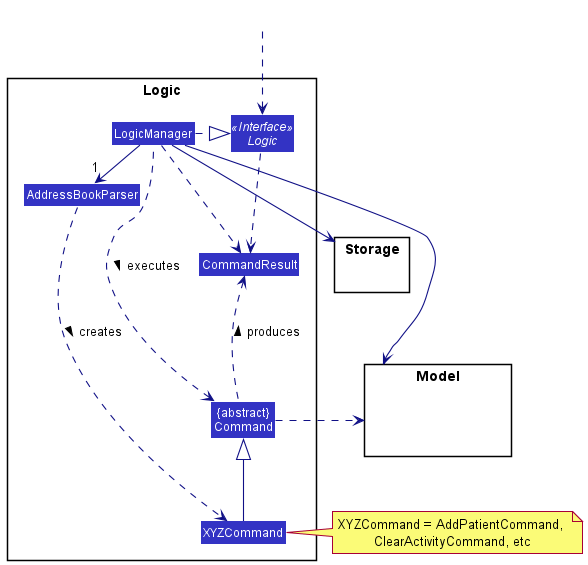

How the `Logic` component works:

1. When `Logic` is called upon to execute a command, it uses the `AddressBookParser` class to parse the user command.
2. This results in a `Command` object (more precisely, an object of one of its subclasses e.g., `AddPatientCommand`
   which is executed by the `LogicManager`.
3. The command can communicate with the `Model` when it is executed (e.g. to add a patient).
4. The result of the command execution is encapsulated as a `CommandResult` object which is returned from `Logic`.

The Sequence Diagram below illustrates the interactions within the `Logic` component for the
`execute("delete t/patient P001")` API call.

Here are the other classes in `Logic` (omitted from the class diagram above) that are used for parsing a user command:

How the parsing works:

* When called upon to parse a user command, the `AddressBookParser` class creates an `XYZCommandParser` (`XYZ` is a
  placeholder for the specific command name e.g., `AddPatientParser`) which uses the other classes shown above to parse
  the user command and create a `XYZCommand` object (e.g., `AddPatientCommand`) which the `AddressBookParser` returns back as
  a `Command` object.
* All `XYZCommandParser` classes (e.g., `AddPatientParser`, `DeletePatientParser`, ...) inherit from the `Parser`
  interface so that they can be treated similarly where possible e.g, during testing.

### Model component

**API** : [`Model.java`](https://github.com/AY2122S1-CS2103T-T15-1/tp/tree/master/src/main/java/gomedic/model/Model.java)

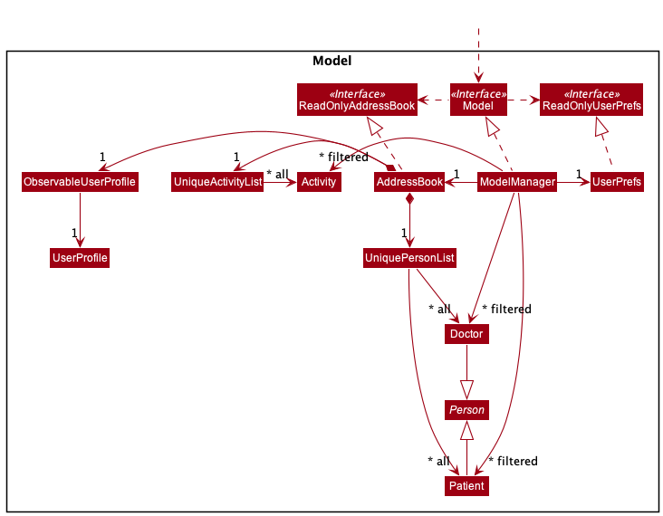

The `Model` component,

* stores address book data, which consists of `Doctor`, `Patient`, `Activity` objects and one `UserProfile` object.

* `Doctor` and `Patient` Objects are each contained within their own `UniquePersonList<Doctor>` or 
`UniquePersonList<Patient>` object respectively while `Activity` objects are contained within a `UniqueActivityList` object.

* stores the currently 'selected' `Doctor` or `Patient` objects (e.g., results of a search query) as a separate _filtered_ list which
is exposed to outsiders as an unmodifiable `ObservableList<Doctor>` or `ObservableList<Patient>`.

* stores the currently 'selected' `Activity` objects (e.g., results of a search query) as a separate _filtered_ list which
is exposed to outsiders as an unmodifiable `ObservableList<Activity>`. `Activity`
objects can be filtered by its internal id or by its starting time.

*  `ObservableList<T>` objects are objects that can be 'observed'. e.g. the UI can be bound to this list so that the UI automatically updates when the data in the list change.

* stores a `UserPref` object that represents the user’s preferences. This is exposed to the outside as
  a `ReadOnlyUserPref` objects.

* does not depend on any of the other three components (as the `Model` represents data entities of the domain, they
  should make sense on their own without depending on other components)

### Storage component

**API** : [`Storage.java`](https://github.com/AY2122S1-CS2103T-T15-1/tp/tree/master/src/main/java/gomedic/storage/Storage.java)

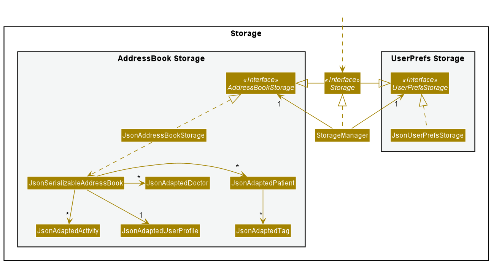

The `Storage` component handles the storing and loading of the data that GoMedic requires in order to function. 
These include user-created data, such as the patients, activities, doctors, and the user profile that is stored in GoMedic, 
as well as data related to the preferences and settings in GoMedic.

The `Storage` component makes use of the `Jackson` library to parse the data from GoMedic into a `JSON` format, and vice-versa.

* To load data from the user's hard disk, it parses the data stored in human-readable `json` files that reside in the `[JAR file location]/data/` directory. 
This directory is automatically created by GoMedic if it doesn't already exist (usually occurs during the first launch).
* To store data from GoMedic into these files, it parses important attributes of these data (e.g. for a doctor, important information 
would include the doctor's name, phone number and department) into a pre-defined `JSON` format. For doctors, this is defined 
in [`JsonAdaptedDoctor.java`](https://github.com/AY2122S1-CS2103T-T15-1/tp/tree/master/src/main/java/gomedic/storage/JsonAdaptedDoctor.java).

In general, the role of the `Storage` component is to:
* Save both user-created data (which is abstracted as the **AddressBook**) and user preference data in json format, and read them back into corresponding
  objects.
* Make use of its inheritance from both `AddressBookStorage` and `UserPrefStorage` to play the role either one, depending on
  context, and the necessary functions required of it. 

**Note:** To implement the `Storage` architecture, dependencies on some classes in the `Model` component, 
such as `Patient`, `Doctor`, `Activity` and `UserProfile` are required.
This is because the `Storage` component's job is to save/retrieve objects that belong to the `Model`, hence it would need
to access objects from these classes in order to acquire the necessary attributes from these objects to be stored. However,
note that we do not show these dependencies in the diagram above, in order to preserve the high-level design representation of
the `Storage` architecture, and to reduce unnecessary information overload.

### Common classes

Classes used by multiple components are in the `gomedic.commons` package.

--------------------------------------------------------------------------------------------------------------------

## **Implementation**

This section describes some noteworthy details on how certain features are implemented.

### Command History feature

Command history feature helps the user keep track of all commands inputted in the current session and allows navigation
back and forth between all the commands entered in the instance so far.

Given below is an activity diagram showing the event flow when the user executes a key press:

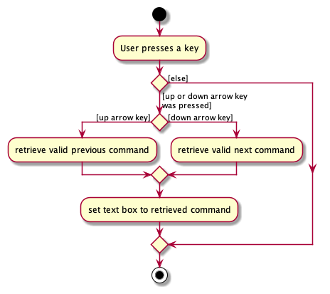

### Suggestions feature

The suggestions feature is facilitated by `Messages`. It is a class consisting of static immutable string messages for 
various fixed error outputs for GoMedic. It also implements the following operations:

* `Messages#getSuggestions(String command)` — Returns suggested commands within GoMedic based on the incorrect command
input.

Given below is a sequence diagram when a user provides an erroneous input, "adl t/patent".

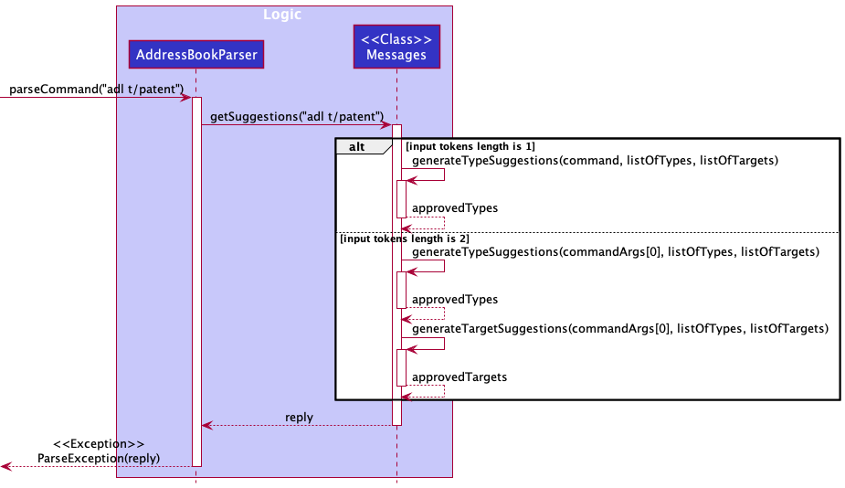

After GoMedic parses the invalid command,

1. Each erroneous command is split into its type, which is the first word of the command, and the target, which is the 
rest of the command, if it exists.
2. The method in the `Messages` class does the appropriate function call(s) suitable for the nature of the erroneous command input
given by the alternate paths in the diagram. 
3. The outputs of the function calls are then compiled and then returned to the `AddressBookParser` to be thrown as an
exception with `reply` as the error message to the user.

**Note:**

* `generateTypeSuggestions` and `generateTargetSuggestions` are private methods only accessed from within getSuggestions and nowhere else.

* The suggestions are generated according to how close the erroneous commands are to the existing commands using the
Levenshtein Distance metric and then ranked. The final output is an intersection of the suggestions generated from the 
two suggestion functions mentioned above.

### Generating Medical Referral Feature 

This feature allows GoMedic users to generate medical referral for a uniquely identified patient identified by his/her `PatientId` to other
doctor that is already saved in the GoMedic application and would be uniquely identified by his/her 
`DoctorId`.

This feature can be accessed using `referral` command which has parameters of `ti/Title`, `di/DoctorId`, `pi/PatiendId` and optional 
description which can be added using `d/Description` flag. 

_This feature uses **iText Java Pdf writer library** to generate the medical referral document._  

**Workflow**

For illustration purposes, suppose the user enters the command:

`referral ti/Referral of Patient A di/D001 pi/P001 d/He is having internal bleeding, need urgent attention.`

:information_source:
**Note:** the doctor id and patient id does not need to conform the `DXXX` and `PXXX` format in this case. However, should the supplied ids are invalid,
GoMedic would be unable to find the doctor and the patient, and would show the feedback patient/doctor not found message to the user.

Once the user enter the command is entered, the following **Sequence Diagram** below shows how the components specified in the [architecture](#architecture) interact with each other creates the new `ReferralCommand` object

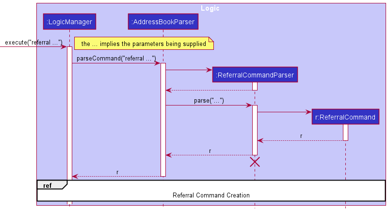

After the `LogicManager` receives the new `ReferralCommand` object, 

1. The `ReferralCommand` then would call the appropriate methods from the `Model` to obtain the `UserProfile`, DoctorList` and `PatientList`
2. Based on the illustration, `ReferralCommand` then would filter and check for the existence of patient whose id is `P001` and doctor whose id is `D001`.

Where the specific methods are shown in the sequence diagram shown below : 

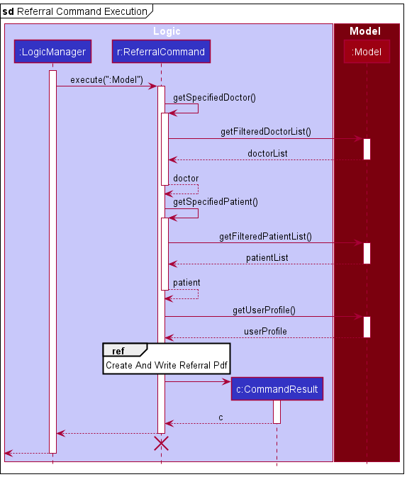

When the data is ready, the `ReferralCommand` object would call the `iTextPdf` library *APIs* that enable it to create a new Pdf document as shown 
in the sequence diagram below : 

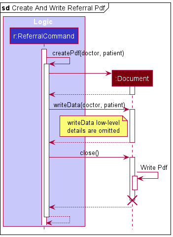

Finally, the pdf object is written into the `data/` folder whose filename is the same of that of the `title` (i.e. _title_.pdf). 
For this illustration, the file then would be `Referral of Patient A.pdf`.

### Customizing user's personal profile in GoMedic
This feature allows the user to customize his or her profile details on GoMedic. These details can then be used to 
sign off the referrals generated by the `referral` command. 

This feature can be accessed using the `profile` command. The user can customize these details through the parameters:
* `n/NAME` : The name of the user
* `p/POSITION`: The position held by the user
* `de/DEPARTMENT`: The department that the user works in
* `o/ORGANIZATION`: The organization that the user works in

Given below is the sequence diagram when a user provides an example of a valid `profile` command 
(`profile n/Jon Snow p/Senior Consultant de/Department of Neurology o/National University Hospital`)
to update his or her profile in GoMedic.

:information_source:
**Note:** The example below does not include the details of the creation of a `ProfileCommand` object, as the
implementation is similar to that of the example covered in the `ReferralCommand` above.

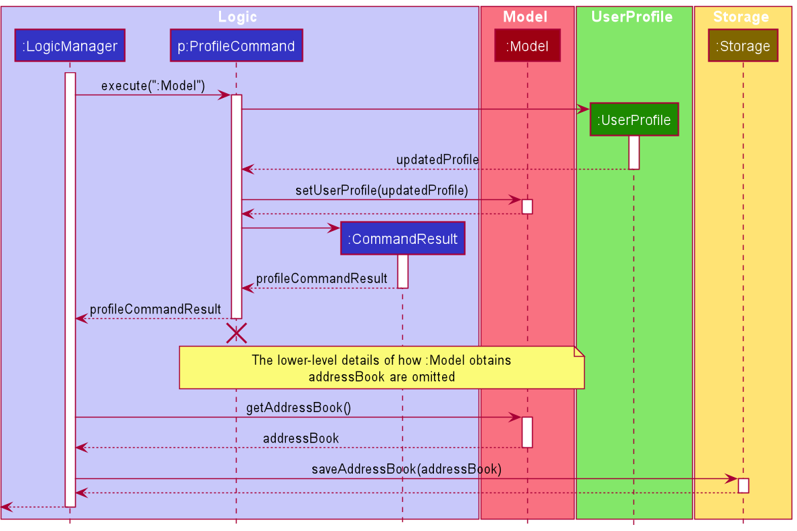

As seen in the diagram above, after the `LogicManager` receives the `ProfileCommand` object,

1. The `LogicManager` will call the `execute` method of `ProfileCommand`, passing in the `Model` as a parameter to the method.
2. The `ProfileCommand` will then create a new `UserProfile` object based on the details specified by the user in the command.
3. Then, `ProfileCommand` will call `Model#setUserProfile(updatedProfile)` to replace the existing user profile with the new one.
4. The `ProfileCommand` will create a `CommandResult` and return it to `LogicManager`.
5. `LogicManager` then calls `Model#getAddressBook()` to get the newly updated address book in the model.
6. Finally, `LogicManager` calls `Storage#saveAddressBook(addressBook)` to update the new user profile in the storage and returns
the `CommandResult` to be displayed to the user.

### View feature
This feature allows user to view patient's details as PatientTable does not show complete details of the patients.

This feature can be accessed using the `view` command, which currently only support the viewing of patient which follows
the following format `view t/patient PATIENT_ID` where `PATIENT_ID` is a valid id of a patient.

Given below is the sequence diagram when a user provides an example of a valid `view` command
(`view t/patient P001`) to see the complete details of the patient.

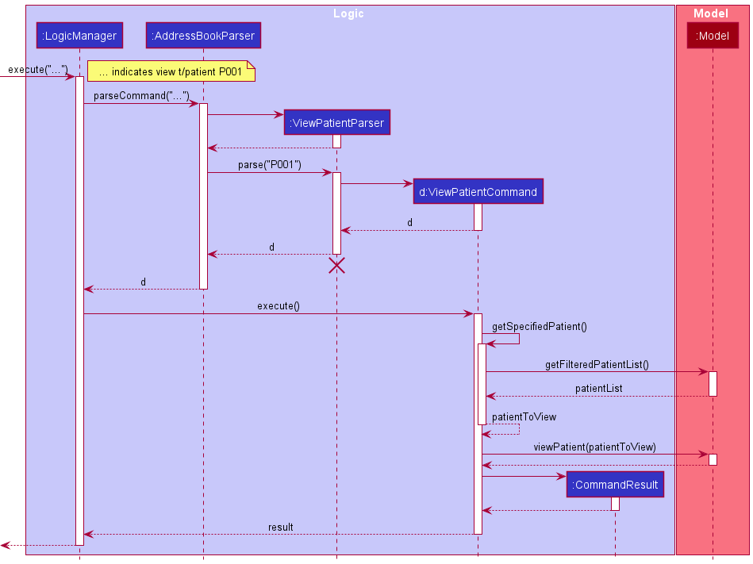

### \[Proposed\] Undo/redo feature

#### Proposed Implementation

The proposed undo/redo mechanism is facilitated by `VersionedAddressBook`. It extends `AddressBook` with an undo/redo
history, stored internally as an `addressBookStateList` and `currentStatePointer`. Additionally, it implements the
following operations:

* `VersionedAddressBook#commit()` — Saves the current address book state in its history.
* `VersionedAddressBook#undo()` — Restores the previous address book state from its history.
* `VersionedAddressBook#redo()` — Restores a previously undone address book state from its history.

These operations are exposed in the `Model` interface as `Model#commitAddressBook()`, `Model#undoAddressBook()`
and `Model#redoAddressBook()` respectively.

Given below is an example usage scenario and how the undo/redo mechanism behaves at each step.

Step 1. The user launches the application for the first time. The `VersionedAddressBook` will be initialized with the
initial address book state, and the `currentStatePointer` pointing to that single address book state.

Step 2. The user executes `delete 5` command to delete the 5th person in the address book. The `delete` command
calls `Model#commitAddressBook()`, causing the modified state of the address book after the `delete 5` command executes
to be saved in the `addressBookStateList`, and the `currentStatePointer` is shifted to the newly inserted address book
state.

Step 3. The user executes `add n/David …​` to add a new person. The `add` command also calls `Model#commitAddressBook()`
, causing another modified address book state to be saved into the `addressBookStateList`.

:information_source: **Note:** If a command fails its execution, it will not call `Model#commitAddressBook()`, so the address book state will not be saved into the `addressBookStateList`.

Step 4. The user now decides that adding the person was a mistake, and decides to undo that action by executing
the `undo` command. The `undo` command will call `Model#undoAddressBook()`, which will shift the `currentStatePointer`
once to the left, pointing it to the previous address book state, and restores the address book to that state.

:information_source: **Note:** If the `currentStatePointer` is at index 0, pointing to the initial AddressBook state, then there are no previous AddressBook states to restore. The `undo` command uses `Model#canUndoAddressBook()` to check if this is the case. If so, it will return an error to the user rather
than attempting to perform the undo.

The following sequence diagram shows how the undo operation works:

The `redo` command does the opposite — it calls `Model#redoAddressBook()`, which shifts the `currentStatePointer` once
to the right, pointing to the previously undone state, and restores the address book to that state.

:information_source: **Note:** If the `currentStatePointer` is at index `addressBookStateList.size() - 1`, pointing to the latest address book state, then there are no undone AddressBook states to restore. The `redo` command uses `Model#canRedoAddressBook()` to check if this is the case. If so, it will return an error to the user rather than attempting to perform the redo.

Step 5. The user then decides to execute the command `list`. Commands that do not modify the address book, such
as `list`, will usually not call `Model#commitAddressBook()`, `Model#undoAddressBook()` or `Model#redoAddressBook()`.
Thus, the `addressBookStateList` remains unchanged.

Step 6. The user executes `clear`, which calls `Model#commitAddressBook()`. Since the `currentStatePointer` is not
pointing at the end of the `addressBookStateList`, all address book states after the `currentStatePointer` will be
purged. Reason: It no longer makes sense to redo the `add n/David …​` command. This is the behavior that most modern
desktop applications follow.

The following activity diagram summarizes what happens when a user executes a new command:

--------------------------------------------------------------------------------------------------------------------

## **Documentation, logging, testing, configuration, dev-ops**

* [Documentation guide](Documentation.md)
* [Testing guide](Testing.md)
* [Logging guide](Logging.md)
* [Configuration guide](Configuration.md)
* [DevOps guide](DevOps.md)

--------------------------------------------------------------------------------------------------------------------

## **Appendix: Requirements**

### Product scope

**Target user profile**:

* has a need to manage a significant number of patients and colleagues
* is a very busy man with lots of appointments and activities
* prefer desktop apps over other types
* can type fast and prefer CLI-formatted commands
* prefers typing to mouse interactions and is reasonably comfortable using CLI apps
* often forgets about his patient details and his schedule

**Value proposition**:

* manage patients contacts faster than a typical mouse/GUI driven app
* able to manage other doctors' details
* able to store sheer amount of patient details and retrieve them very fast
* able to compare patient medical histories very fast
* able to remind user of upcoming activities and appointments
* easy to use and would give suggestion on the closest command whenever typo is made

### User stories

**Priorities:**
* **High (must have)** - `* * *`
* **Medium (nice to have)** - `* *`
* **Low (unlikely to have)** - `*`

#### [EPIC] Basic CRUD Functionality for patients and doctors

| Priority | As a …​                                 | I want to …​                             | So that I can…​                                                        |
| -------- | ------------------------------------------ | --------------------------------------------| ---------------------------------------------------------------------- |
| `* * *`  | user                                       | add a new patient detail                    | retrieve and update them later                                                                        |
| `* * *`  | doctor                                     | add a new colleague detail                  | remember their contact number and office numbers
| `* * *`  | user                                       | delete an existing patient / doctor details | remove entries that I no longer need
| `* * *`  | user                                       | update my patient details                   | change the details without deleting and adding the info again
| `* * *`  | doctor                                     | update my colleague details                 | change the details without deleting and adding the info again
| `* * *`  | user                                       | view all my patient details in a list       | know my entire list of patients at a glance
| `* * *`  | user                                       | view all my colleague details in a list     | know my entire list of colleague at a glance

#### [EPIC] Scheduling

| Priority | As a …​                                 | I want to …​                                            | So that I can…​                                                        |
| -------- | ------------------------------------------ | -----------------------------------------------------------| ---------------------------------------------------------------------- |
| `* * *`  | busy user                                  | add a new appointment with one of my patient               | so that I can remember my appointments with them and be reminded of them in the future
| `* * *`  | busy user                                  | add new activities such as meeting with colleagues         |  so that I can remember my schedules today with and be reminded of them in the future
| `* * *`  | user                                       | delete existing appointments with my patients              | remove appointments that are no longer happening                |
| `* * *`  | user                                       | delete any existing activity                               | remove activities that are no longer happening and free my schedules up                                                 |
| `* *  `  | organized user                             | list all my future appointments with a certain patient     | plan my schedules and track the appointments                                                 |
| `* * *`  | organized user                             | list all my future activities                              | know my schedules and plan future activities accordingly                           |
| `*    `  | busy user                                  | be reminded of my patients' appointment 15 minutes before the schedule             | prepare myself for the appointment                         |
| `*    `  | busy user                                  | be reminded of my daily schedule when the app is started / at the start of the day |   know what I will be doing for the day and plan ahead                          |
| `* *  `  | forgetful user                             | search for specific activities and appointments within a specific time frame       | plan ahead and focus on those time slots only                         |
| `*    `  | organized user                             | change the reminder settings (minutes)                     | tailor it according to my preference                         |

#### [EPIC] Information Retrieval and Organization

| Priority | As a …​                                 | I want to …​                                                        | So that I can…​                                                        |
| -------- | ------------------------------------------ | -----------------------------------------------------------------------| --------------------------------------------------------------------------|
| `*    `  | experienced user                           | search for activities based on its title and description               | retrieve certain grouped activities very fast such as meetings and visitations
| `* * *`  | busy user                                  | search for patients whose details contain a user-specified substring   | retrieve certain patients that I don't really remember which fields where the details are stored at
| `* * *`  | busy user                                  | search for doctors whose details contain a user-specified substring    | retrieve my colleague details without any need to remember which fields the data are stored at

#### [EPIC] Misc Helpful Features

| Priority | As a …​                                 | I want to …​                                                        | So that I can…​                                                        |
| -------- | ------------------------------------------ | -----------------------------------------------------------------------| --------------------------------------------------------------------------|
| `* * *`  | new and forgetful user                     | pull up a list of commands                                             | pick the right commands quickly
| `* * *`  | new user                                   | sample entries in the app                                              | know how the app would look like when I would populate it with my data
| `* * *`  | new user                                   | have suggestions on typo that I made on commands                       | learn from my mistakes and correct it quickly
| `* *`    | fickle user                                | have the app accept multiple fixed ways to write dates and times       | do not need to remember the correct format all the time

*{More to be added}*

### Use cases

(For all use cases below, the **System** is the `GoMedic` and the **Actor** is the `user`, unless specified otherwise)

**Use Case: [UC1] - Adding a new patient record**

**MSS**

1. User requests to add a new patient record.
2. GoMedic shows confirmation about the new patient record being added, and displays the patient's full details.

   Use case ends.

**Extensions**

* 1a. Incomplete patient details are given by users

    * 1a1. GoMedic shows a feedback to the user about the missing data.

      Use Case ends.
    
* 2a. Wrong patient details (not following the given constraints)
    
    * 2a1. GoMedic shows a feedback to the user about the violation.
        
      Use Case ends.

**Use Case: [UC2] - Delete an existing patient record**

**MSS**

1. User requests to list all patients.
2. GoMedic shows a list of patients.
3. User requests to delete a specific person in the list.
4. GoMedic deletes the person.

   Use case ends.

**Extensions**

* 2a. The list is empty.

  Use case ends.

* 3a. The given index is invalid.

    * 3a1. GoMedic shows a feedback to the user about invalid index.

      Use case ends.

**Use Case: [UC3] - Command Suggestions**

**MSS**

1. User types in a certain command such as creating <u>new patient record (UC1)</u> and <u>deleting an existing patient
   record (UC2)</u> with typo.
2. GoMedic shows a list of suggested commands.
3. User retypes the command and requests GoMedic to perform certain action.
4. GoMedic performs the specified action.

   Use case ends.

**Extensions**

* 1a. Command is valid.

  Use case ends.

* 2a. User decides not to retype the commands.

  Use case ends.

* 3a. User input an invalid command.

  Use case resumes at step 1.

**Use Case: [UC4] - Adding a new appointment record**

**MSS**

1. User requests to add a new appointment record.
2. GoMedic shows confirmation about the new appointment record being added, and displays details of the appointment and
which patient it is scheduled with.

   Use case ends.

**Extensions**

* 1a. Incomplete appointment details are given by users

  * 1a1. GoMedic shows a feedback to the user about the missing data.

    Use Case ends.
* 1b. Patient which does not currently exist in the system is given.
  * 1b1. GoMedic shows a feedback to the user about invalid patient
  
    Use Case ends.

**Use Case: [UC5] - Searching for specific records based on a specific field**

**MSS**
1. User requests to search within either the Patient, Doctor, or Activity category, specifying a substring 
   and a field to which that substring should be matched to. 
   
2. GoMedic shows a response message with the number of matches that have been found, and
displays the matching records.
   
    Use case ends.
   
**Extensions**
* 1a. GoMedic gives feedback to user that no matches are found if there are no matching
entries corresponding to the user's input.
  
  Return.
  
* 1b GoMedic displays an error when user input is in incorrect format.
    Return.

**Use Case: [UC6] - View an existing patient record**

**MSS**

1. User requests to list all patients.
2. GoMedic shows a list of patients.
3. User requests to view a specific patient in the list.
4. GoMedic shows the person details

   Use case ends.

**Extensions**

* 2a. The list is empty.

  Use case ends.

* 3a. The given index is invalid.

    * 3a1. GoMedic shows a feedback to the user about invalid index.

      Use case ends.

**Use Case: [UC7] - Clear all doctors records in GoMedic**

**MSS**

1. User requests to list all doctors.
2. GoMedic shows a list of doctors.
3. User requests to clear all records of the doctors.

   Use case ends.

**Extensions**

* 2a. The list is empty.

  Use case ends.
    
*{More to be added}*

### Non-Functional Requirements

1. Should work on any _mainstream OS_ as long as it has Java `11` or above installed.
2. Should be able to be run without any installation required as long as the user has Java `11` installed.
3. Should be able to hold up to 1000 patients and colleagues without a noticeable delay (less than 2 seconds) in
   performance for typical usage.
4. Should be able to hold up to 200 future activities and future appointments, and be retrieved without a noticeable
   delay (less than 2 seconds) for typical searches.
5. Should be only used by a single user and do not require other users to make changes to the app such as making
   appointment or sharing activities.
6. The data should not be stored using a _DBMS_.
7. The data should be stored _locally_ and should be in a human _editable_ and easily modified text file.
8. The project is expected to adhere to a _biweekly version release_ using breadth-first incremental technique.
9. Should be less than **100 MB** in size for the software, and less than **15 MB** per file for each document.
10. The developer guide and user guide must be pdf-friendly (meaning no embedded video, animations, embedded PowerPoint,
    etc.).
11. Should be delivered to the user using a single JAR file.
12. Graphical User Interface (GUI) should work reasonable well for standard screen resolution of 1920 x 1080 and higher
    with screen scales 100% and 125%, and also usable for screen resolutions 1280 x 720 and higher with screen scales
    150%.
13. Should be written mainly using Object-oriented paradigm.
14. The app is not required to be able to interact with external pieces of hardware such as printer.
15. The data stored within the app should be encrypted for security purposes (to prevent the raw data being read by
    external parties).
16. The app is mainly used for users based in Singapore, and therefore some local terms are tolerable, and the app is
    not expected to operate in other languages except English.

*{More to be added}*

### Glossary

* **Mainstream OS**: Windows, Linux, Unix, OS-X.
* **DBMS** : Database Management System such as MySQL, Oracle, PSQL, MongoDB, etc.
* **JAR** : Java Archive file format, which is typically used to aggregate many Java class files and associated metadata
  into one file for distribution.
* **Typical usage/searches** : Finding by keyword, name, medical histories, and any combination of the field manually.
* **Object-Oriented Paradigm** : programming paradigm that organizes software design around objects rather than
  functions and logic. For complete list of Features that OO design should have,
  please [visit this wikipedia page](https://en.wikipedia.org/wiki/Object-oriented_programming)

--------------------------------------------------------------------------------------------------------------------

## **Appendix: Instructions for manual testing**

Given below are instructions to test the app manually.

:information_source: **Note:** These instructions only provide a starting point for testers to work on;
testers are expected to do more *exploratory* testing.

### Launch and shutdown

1. Initial launch

    1. Download the jar file and copy into an empty folder

    1. Double-click the jar file. If you are unable to do so, you might need to run `java -jar gomedic.jar` from the terminal where the `gomedic.jar` file is located. Expected: Shows the GUI with a set of sample contacts. The window size may not be
       optimum.

1. Saving window preferences

    1. Resize the window to an optimum size. Move the window to a different location. Close the window.

    1. Re-launch the app by double-clicking the jar file. 
       Expected: The most recent window size and location is retained.
    
### Deleting an activity

1. Deleting an activity while all activities are being shown

    1. Prerequisites: List all activities using the `list t/activity` command. 
       Ensure at least 1 activity with id `A001` is there, otherwise please use `add t/activity` command to add a new activity. 
       Multiple activities will be displayed in a table sorted by its id.

    2. Test case: `delete t/activity A001` 
       Expected: Activity whose id `A001`. Details of the deleted contact shown in the feedback box. 

    3. Test case: `delete t/activity A001` 
       Expected: No activity is deleted. Error details shown in the feedback box. 

    4. Other incorrect delete commands to try: `delete t/activity`, `delete t/doctor`, `delete t/activity x`, `...` (where x is an invalid id) 
       Expected: Similar to previous for each patient, doctor and activity model.

### Finding a patient, doctor or activity
1. Searching for a doctor or a patient
    1. Prerequisite: List the patients, doctors, or activities based on which one you wish to see, using the `list` command.
    e.g. `list t/doctor` or `list t/patient` or `list t/activity`.
       
    2. Test case: e.g. `find t/patient n/Joe`
        Expected: All patients whose names contain the substring "Joe" (case-insensitive) will be displayed.
       
    3. Test case: e.g. `find t/activity ti/Meeting`
        Expected: All activities whose title or description contains the substring "Meeting" (case-insensitive) will be displayed. 
       
    4. Other incorrect find commands to try: `find t\patient Joe` 
        Expected: Error message as a flag is not specified prior to the keyword. 

