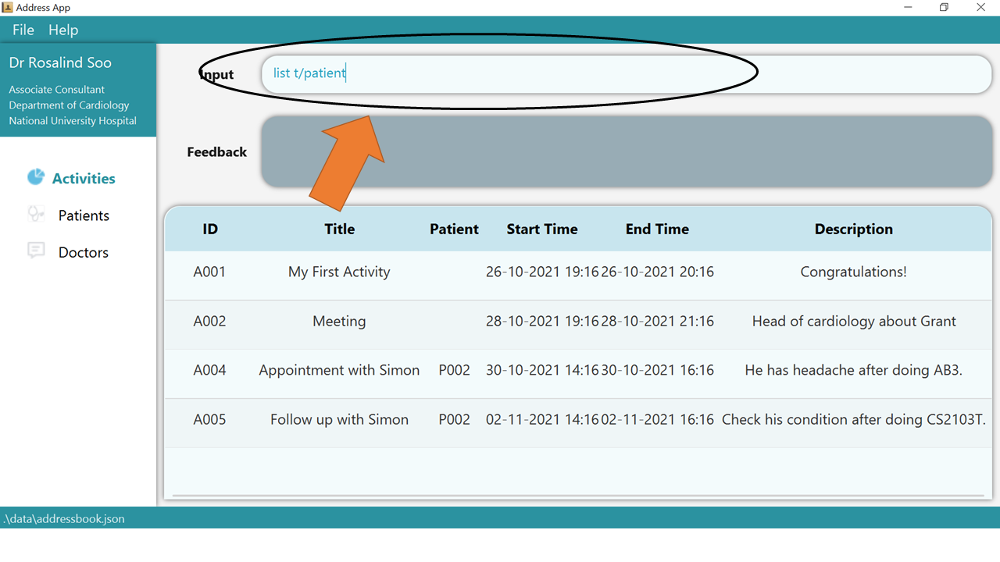

GoMedic is a **cross-platform desktop application written in Java and designed for doctors and medical residents to
manage contacts and patient details**. We aim for GoMedic to be used by someone who can type fast and take advantage of the
optimized features for Command Line Interface.

GoMedic is bootstrapped using SE-EDU Address Book 3 and inherits some of its features such as `clear`, parameter
formatting, etc.

* Table of Contents
{:toc}

--------------------------------------------------------------------------------------------------------------------

# Quick start

1. Ensure you have Java `11` or above installed in your Computer.

2. Download the latest `gomedic.jar` from [here](https://github.com/AY2122S1-CS2103T-T15-1/tp/releases).

3. Copy the file to the folder you want to use as the _home folder_ for your GoMedic.

4. Double-click the file to start the app. The GUI similar to the below should appear in a few seconds. Note how the app
   contains some sample data. 
   

5. Type the command in the command box and press Enter to execute it. e.g. typing **`help`** and pressing Enter will
   open the help window. 
   Some example commands you can try:

    * **`list t/patient`** : Lists all patients.

    * **`add t/patient n/John-Doe a/30 g/M h/174 w/72 b/O p/12345678 m/heart-failure m/diabetes`** : Adds a patient
      named `John Doe` to GoMedic.

    * **`delete t/patient P001`** : Deletes the patient whose id is P001.

    * **`clear`** : Deletes all contacts including patients, doctors, and activities.

    * **`exit`** : Exits the app.
6. **Address Book, GoMedic Address Book, and GoMedic** refers to the same term, which is just the application itself.
7. Refer to the [Features](#features) below for details of each command.

--------------------------------------------------------------------------------------------------------------------

# How To Use This Guide

This user guide provides information to assist you in using **GoMedic** based on which features you are most interested in. 
The user guide is sectioned such that each chapter has an 
* **Overview** : Explaining what the feature offers and some important reminders about the notations used in that particular chapter
* **Features** : List of commands available within that section 
  * **Format** : list of fields that need to be supplied for that particular command
  * **Parameters** : Explanation about each field, together with its constraints
  * **Examples** : tutorial with pictures on how to use the commands. 

:bulb: **Tip:** You can always go back to the table of content page and just click on which feature you are currently interested at, as each feature has a very comprehensive tutorial !

To get the most out of this user guide, it would be best to understand the terminologies and notations that would often be used in this user guide. 
Some important notations would be repeated in the **Overview** section of each chapter (such as **Activity Related Feature**) to remind you of those notations again. 

So don't worry if you forget some [notations](#about-the-commands) along the way, or after you have not touched this User Guide for a while, you can always check this page or the **Overview** section to find 
the important notations that are used in that chapter. 

## How GoMedic Looks Like 

## About the Commands
**:information_source: Understanding The Notations:** 

* Words in `UPPER_CASE` are the parameters to be supplied by the user. 
  e.g. in `add n/NAME`, `NAME` is a parameter which can be used as `add n/John Doe`.

* Items in square brackets are optional. 
  e.g. `n/NAME [t/TAG]` can be used as `n/John Doe t/friend` or as `n/John Doe`.

* Items with `…`​ after them can be used multiple times including zero times. 
  e.g. `[m/MEDICAL_CONDITION]…​` can be used as ` ` (i.e. 0 times), `m/diabetes`, `m/fever m/flu` etc.

* Parameters can be in any order. 
  e.g. if the command specifies `n/NAME p/PHONE_NUMBER`, `p/PHONE_NUMBER n/NAME` is also acceptable.

* If a parameter is expected only once in the command but you specified it multiple times, only the last occurrence of
  the parameter will be taken. 
  e.g. if you specify `p/12341234 p/56785678`, only `p/56785678` will be taken.

* Extraneous parameters for commands that do not take in parameters (such as `help`, `exit` and `clear`) will be
  ignored. 
  e.g. if the command specifies `help 123` or `help x/123`, it will be interpreted as `help`.

## Error Messages

1. Should you enter an **invalid** command that **GoMedic** cannot recognize, **GoMedic** would
return some suggestions on the closest commands that you can choose from!

   * For example, as `list` command is not available, **GoMedic** would return you the closest commands available which are 
   `list t/acitivty`, `list t/patient`, and `list t/doctor`. 

    To understand more how the suggestion works, please refer to [this](#suggestions) section.

2. Should you enter an **valid** command but in its **invalid** format, meaning some parameters are missing.
**GoMedic** would highlight the command in red and shows the correct usage in the feedback box. 
3. Should you enter a **valid** command in a **valid** format, but there is a wrong parameter. 
**GoMedic** would only flag the first invalid parameter as not to overwhelm you with the error messages. 
   * Invalid parameters can be caused by constraints' violation, such as inputting blood type X for a patient, where such blood type does not exist.   

:bulb: **Tip:**
To fix the multiple parameters' errors in a command, you can fix them one by one based on the feedback that **GoMedic** give and use the [navigation](#navigating-past-commands) feature to get the previous command!

## Patients Related Features

### Overview

Patients related features allow you to store, edit, view, and list patients.

Using patients, you can store your patients' details and track all of the medical conditions that your patients are
suffering from.

**:information_source: Reminder on Command Notation:** 
Each patient is **uniquely** identified by its `PATIENT_ID` in the form of `PXXX` where `XXX` is a 3-digit integer.
Therefore, two patients with exactly same `NAME`, `PHONE_NUMBER`, `AGE`, `GENDER`, `HEIGHT`, `WEIGHT`, `BLOOD_TYPE`, 
and `MEDICAL_CONDITIONS` with different `PATIENT_ID` are considered distinct.

**:information_source: Reminder on Command Notation:** 

* Some important notation in reading the commands
    * `[flag/KEYWORD]` indicates optional parameters
    * `flag/KEYWORD` indicates mandatory parameters

### Adding a new patient: `add t/patient`

Adds a new patient into your **GoMedic** application.

**Format**: `add t/patient n/NAME p/PHONE_NUMBER a/AGE g/GENDER h/HEIGHT w/WEIGHT b/BLOOD_TYPE [m/MEDICAL_CONDITION]...`

**GoMedic** would create a new patient based on the smallest `PATIENT_ID` available.

* GoMedic would check for any invalid field as specified [here](#patient_constraint). Should there be any, the new
patient will not be added.

The parameters are :

Parameters    |  Explanation                                      | Constraints                                          |                
--------------|---------------------------------------------------|----------------------------------------------------- |
`n/NAME`      | full name of the patient                          | must only contain alphanumeric characters and spaces, and it should not be blank|
`p/PHONE_NUMBER`| phone number of the patient                     | must be **entirely numeric** and contain at least 3 digits       |
`g/GENDER`    | gender of the patient                             | must be `M/F/O` where `M` is for Male, `F` is for Female, and `O` is for Others, all non capitalized letters will be capitalized, e.g. `m` input will be treated as `M`|
`h/HEIGHT`    | height of the patient in centimeters              | must be integer between 1 and 300 inclusive          |
`w/WEIGHT`    | weight of the patient in kilograms                | must be integer between 1 and 700 inclusive          |
`b/BLOOD_TYPE`| blood type of the patient                         | must be `A+/A-/B+/B-/AB+/AB-/O+/O-`, all non capitalized letters will be capitalized, e.g. `a+` input will be treated as `A+`|
`m/MEDICAL_CONDITION`| list of patient's past/pre-existing medical conditions| must only contain alphanumeric characters and spaces, with maximum of *30* characters|

:exclamation: **Extra Constraints**  

* `MEDICAL_CONDITION` is **unique**.
* Duplicate of `MEDICAL_CONDITION` provided will be discarded.

**Example:**

&#8291;1. Type the command `add t/patient n/John Smith p/98765432 a/45 b/AB g/M h/175 w/70 m/heart failure m/diabetes` into
the command box.

&#8291;2. Press `Enter` and you should see the new entry being made in the Patient table! By default, the table would be sorted by ID.

&#8291;3. If there is any error, the command would turn red as indicated by **1** and the feedback would be given in the feedback box at **2**.
In this case, the error is because we are putting invalid blood type. Fix the issue and press enter again!
Now the command should work correctly!

To understand better how **GoMedic** classifies the error messages, please refer to [this](#error-messages) section.

### Deleting an existing patient: `delete t/patient`

Deletes a certain existing patient from **GoMedic**.

**Format**: `delete t/patient PATIENT_ID`

The parameter is:

Parameters    |  Explanation                                      | Constraints                                          |                
--------------|---------------------------------------------------|----------------------------------------------------- |
`PATIENT_ID`  | the Patient Id as shown by the Patient table      | Must be in the form of `PXXX` where `XXX` is 3-digit integer. For full info, please refer to [this](#overview) |

:bulb: **Tip:** Patient ID can be obtained by listing all the patients using [`list t/patient` command](#list-all-patients-list-patient)
or search the specific patient using [`find t/patient` command](#finding-entries-find-optional_parameters).

**Example:**

&#8291;1. Type the command `delete t/patient P001` into the command box.

&#8291;2. Press `Enter` and you will get confirmation that the patient is indeed deleted. Check that the patient identified by the deleted ID should not be there.

&#8291;3. If there is any error, the command would turn red as shown by **1**. Also, the feedback about the error is shown by the
feedback box shown at **2**. Fix the issue and the command should work correctly now!

To understand better how **GoMedic** classifies the error messages, please refer to [this](#error-messages) section.

### List all patients: `list t/patient`

List all patients that is stored in **GoMedic**.

**Format**: `list t/patient`

**Example:**

&#8291;1. Type the command `list t/patient` into the command box.

&#8291;2. Press `Enter` and the success confirmation should be shown by the feedback box as shown by **1**. Realize that the patient table is shown by **2**.

### Updating an existing patient's details: `edit t/patient`

Edits a patient's details from the **GoMedic** application.

**Format**: `edit t/patient i/PATIENT_ID [OPTIONAL_PARAMETERS]...`

:exclamation: **Caution:**
* The `PATIENT_ID` is assigned by **GoMedic** and cannot be modified at all once created.

* The `MEDICAL_CONDITIONS` will be replaced by the new `MEDICAL_CONDITIONS` supplied in the edit command.

:bulb: **Tip:** You can update multiple fields at the same time !

The parameters are:

Parameters    |  Explanation                                      | Constraints                                          |                
--------------|---------------------------------------------------|----------------------------------------------------- |
`i/PATIENT_ID`| the unique identifier of a patient                | must be in the form of `PXXX` where `XXX` is 3-digit integer. For full info, please refer to [this](#overview)|
`n/NAME`      | full name of the patient                          | must only contain alphanumeric characters and spaces, and it should not be blank|
`a/AGE     `  | age of the patient                                | must be integer between 0 and 150 inclusive          |
`p/PHONE_NUMBER`| phone number of the patient                     | must be **entirely numeric** and contain at least 3 digits|
`g/GENDER`    | gender of the patient                             | must be `M/F/O` where `M` is for Male, `F` is for Female, and `O` is for Others, all non capitalized letters will be capitalized, e.g. `m` input will be treated as `M`|
`h/HEIGHT`    | height of the patient in centimeters              | must be integer between 1 and 300 inclusive          |
`w/WEIGHT`    | weight of the patient in kilograms                | must be integer between 1 and 700 inclusive          |
`b/BLOOD_TYPE`| blood type of the patient                         | must be `A+/A-/B+/B-/AB+/AB-/O+/O-`, all non capitalized letters will be capitalized, e.g. `a+` input will be treated as `A+`|
`m/MEDICAL_CONDITION`| list of patient's past/pre-existing medical conditions| must only contain alphanumeric characters and spaces, with maximum of *30* characters|

**Example:**

&#8291;1. Type the command `edit t/patient i/P002 n/John Snow p/91234567 a/30 b/AB g/M h/185 w/85 m/cancer` into the command box. Ensure that the edited patient as identified by its `PATIENT_ID` exists!

&#8291;2. Press `Enter` and the success confirmation should be shown by the feedback box as shown by **1**. Realize that as shown by **2**, patient `P002` has its information updated!

&#8291;3. If there is any error, the command would turn red as shown by **1**. Also, the feedback about the error is shown by the feedback box shown at **2**.
In this case, the error is because we are putting invalid blood type. Fix the issue and press enter again!
Fix the issue and the command should work correctly now!

To understand better how **GoMedic** classifies the error messages, please refer to [this](#error-messages) section.

### Display full details of a patient: `view t/patient`

Displays the full details of a particular patient.

Format: `view t/patient PATIENT_ID`

The parameter is:

Parameters    |  Explanation                                      | Constraints                                          |                
--------------|---------------------------------------------------|----------------------------------------------------- |
`PATIENT_ID`  | the Patient Id as shown by the Patient table      | Must be in the form of `PXXX` where `XXX` is 3-digit integer. For full info, please refer to [this](#overview) |

:bulb: **Tip:** Patient ID can be obtained by listing all the patients using [`list t/patient` command](#list-all-patients-list-patient)
or search the specific patient using [`find t/patient` command](#finding-entries-find-optional_parameters).

**Example:**

&#8291;1. Type the command `view t/patient` into the command box.

&#8291;2. Press `Enter` and the details of the patient will be shown in the screen.

## Doctors Related Features

### Overview

Doctor related features allow you to store, edit and list details of other doctors.

These could be details of your colleagues, or other acquaintances that are important in your work.

Each doctor is **uniquely** identified by his or her `DOCTOR_ID` in the form `DXXX`, where `XXX` is a 3-digit integer.
Therefore, **GoMedic** considers two doctors with the same details (same `NAME`, `PHONE_NUMBER` and `DEPARTMENT`), 
as two distinct and different doctors, as long as their `DOCTOR_ID`s are different.

### Adding a new doctor's details: `add t/doctor`

Adds the details of a doctor into **GoMedic**.

**Format**: `add t/doctor n/NAME p/PHONE_NUMBER de/DEPARTMENT`

**GoMedic** creates a new doctor based on the smallest Doctor ID available. This example is shown [here](#doctor_tutorial),
where a new doctor is added and assigned the ID **D004** instead of **D006**.
 
 **NOTE:**
* A new doctor that is added may not be displayed as the last entry, as the table is sorted by ID. 
* If there are any invalid fields, as specified [here](#doctor_constraint), the new doctor will not be added.

The parameters are:

Parameters      |  Explanation                                      | Constraints                                          |                
----------------|---------------------------------------------------|----------------------------------------------------- |
`n/NAME`        | the name of the doctor.                           | must only contain alphanumeric characters and spaces, and it should not be blank|
`p/PHONE_NUMBER`| the phone number of the doctor.                   | must be **entirely numeric** and contain at least 3 digits                      |
`de/DEPARTMENT` | the department of the doctor.                     | must only contain alphanumeric characters and spaces, and it should not be blank|

**Example:**

&#8291;1. Type the command `add t/doctor n/Timmy Tom p/98765432 de/neurology` into the command box.

&#8291;2. Press `Enter` and you should see the new entry being made in the Doctor table! 
Note that the table is sorted by ID. Hence, in this example, the new entry will not be displayed as the last entry!

&#8291;3. If there are any errors, the command would turn red as shown by **1**. 
In the example below, the user has forgotten to include the `Department` of the doctor. 
Fix the issue by following the command format, shown in **2**, and press `Enter` again; The command should work correctly now!

To understand better how **GoMedic** classifies the error messages, please refer to [this](#error-messages) section.

### Deleting an existing doctor: `delete t/doctor`

Deletes an existing doctor from GoMedic.

**Format**: `delete t/doctor DOCTOR_ID`

:exclamation: **Caution:**
the `DOCTOR_ID` does not require additional flags such as `i/`! Supplying those flags would render the command invalid!

The parameter is:

Parameter     |  Explanation                                      | Constraint                                           |                
--------------|---------------------------------------------------|----------------------------------------------------- |
`DOCTOR_ID`   | the Doctor Id as shown by the Doctor table        | Must be in the form of `DXXX` where `XXX` is 3-digit integer. For the full information, please refer to [this](#overview) |

:bulb: **Tip:** Doctor ID can be obtained by listing all the doctors using [`list t/doctor` command](#list-all-doctors-list-tdoctor) 
or searching for the specific doctor using [`find t/doctor` command](#finding-entries-find-optional_parameters).  

**Example:**

&#8291;1. Type the command `delete t/doctor D001` into the command box.

&#8291;2. Press `Enter` and you will get confirmation that the doctor is indeed deleted. 
Check the doctor table. The doctor identified by the deleted ID should not be there. 

&#8291;3. If there is any error, the command would turn red as shown by **1**. Also, the feedback about the error is shown by the 
feedback box shown at **2**. Fix the issue and the command should work correctly now!

To understand better how **GoMedic** classifies the error messages, please refer to [this](#error-messages) section.

### List all doctors: `list t/doctor`

List all doctors that are stored in **GoMedic**.

**Format**: `list t/doctor`

**Example:**

&#8291;Type the command `list t/doctor` into the command box. Then, the list of doctors will be displayed, as shown below.

### Updating an existing doctor's details: `edit t/doctor`

Edits a doctor's details in **GoMedic**.

**Format**: `edit t/doctor i/DOCTOR_ID [OPTIONAL_PARAMETERS]...`

When editing an existing doctor, all parameters are optional except `DOCTOR_ID`! However, 
* If there are no parameters being supplied at all besides the `DOCTOR_ID`, **GoMedic** would return an error. 
* The new information supplied to the `edit t/doctor` command would still need to conform to the constraints as stated [above](#doctor_constraint).

:exclamation: **Caution:**

The `DOCTOR_ID` is assigned by **GoMedic** and cannot be modified at all once created.

:bulb: **Tip:** You can update multiple fields at the same time!

The parameters are:

Parameters      |  Explanation                                      | Constraints                                          |                
----------------|---------------------------------------------------|----------------------------------------------------- |
`i/DOCTOR_ID`   | the unique identifier of a doctor.                | Must be in the form of `DXXX` where `XXX` is 3-digit integer. For the full information, please refer to [this](#overview)                           |
`n/NAME`        | the name of the doctor.                           | Must only contain alphanumeric characters and spaces, and it should not be blank|
`p/PHONE_NUMBER`| the phone number of the doctor.                   | Must be **entirely numeric** and contain at least 3 digits                      |
`de/DEPARTMENT` | the department of the doctor.                     | Must only contain alphanumeric characters and spaces, and it should not be blank|

**Example:**

&#8291;1. Type the command `edit t/doctor i/D002 de/Radiology` into the command box. Ensure that the edited doctor, as identified by his or her `DOCTOR_ID`, exists! 

&#8291;2. Press `Enter` and the success confirmation should be shown by the feedback box as shown by **1**. 
Realize that as shown by **2**, doctor `D002`, Bernice, has her department updated!

&#8291;3. If there are any errors, the command would turn red as shown by **1**. Also, the feedback about the error is shown by the
feedback box shown at **2**. In this case, the error is that the `NAME` of the edited doctor is not alphanumeric.
Fix the issue and the command should work correctly now!

To understand better how **GoMedic** classifies the error messages, please refer to [this](#error-messages) section.

## Activities Related Features

### Overview 

Activities related features allow you to store, edit and list events and appointments with patients. 

Using activities, you can track down your daily, weekly or even monthly schedules. **GoMedic** would also automatically 
check for any conflicting activities and notify you immediately every time you try to create a new activity or update 
an existing activity.

**:information_source: Notes about the Time format:** 

* There are three accepted datetime formats (GMT+8 24-Hour Time format):
    1. dd/MM/yyyy HH:mm (e.g. 15/09/2022 13:00)
    2. dd-MM-yyyy HH:mm (e.g. 15-09-2022 13:00)
    3. yyyy-MM-dd HH:mm (e.g. 2022-09-15 13:00)

Each activity is **uniquely** identified by its `ACTIVITY_ID` in the form of `AXXX` where `XXX` is a 3-digit integer. 
Therefore, two activities with exactly same `TITLE` and `DESCRIPTION` with different `ACTIVITY_ID` are considered distinct.

---
**Current Activities Related Features That Are Not Supported by GoMedic**

* Creating and editing recurrent events. 
* Associating other doctors for an event.
* Listing the activity in a Calendar style. 

---

**:information_source: Reminder on Command Notation:** 

* Some important notation in reading the commands
    * `[flag/KEYWORD]` indicates optional parameters
    * `flag/KEYWORD` indicates mandatory parameters

### Adding a new activity: `add t/activity`

Adds a new activity into your **GoMedic** scheduler. 

**Format**: `add t/activity s/START_TIME e/END_TIME ti/TITLE [d/DESCRIPTION]`

**GoMedic** would create a new activity based on the smallest `ACTIVITY_ID` available. This example is shown [here](#appointment_tutorial), where
a new activity is being added and get assigned ID **A006** and not A008 which makes it not displayed at the last entry in the list
as the table is sorted by `ACTIVITY_ID` by default.

* GoMedic would check for any partial or full **conflicting activities** if any and notify you immediately. Should there be any,
the current appointment will not be added. 
* GoMedic would also check for any invalid field as specified [here](#activity_constraint). Should there be any, the new activity will not be added. 

The parameters are:

Parameters    |  Explanation                                      | Constraints                                          |                
--------------|---------------------------------------------------|----------------------------------------------------- |
`s/START_TIME`| the starting time of the appointment.             | Please refer to [this](#overview)                           |
`e/END_TIME`  | the ending time of the activity.                  | Please refer to [this](#overview)                           |
`ti/TITLE`    | the title of the activity.                        | maximum of **60** characters                         |
`d/DESCRIPTION`| the description of the activity.                 | maximum of **500** characters                        |

:exclamation: **Extra Constraints**  

* `START_TIME` must be **strictly less** than `END_TIME`. 

* Partial overlap activity is still considered as conflicting activity.

**Example:**

&#8291;1. Type the command `add t/activity s/2022-09-15 14:00 e/15/09/2022 15:00 ti/Meeting with Mr. X d/about a certain paper` into
the command box.

&#8291;2. Press `Enter` and you should see the new entry being made in the Activity table! By default, the table would be sorted by ID.

&#8291;3. If there is any error, the command would turn red as indicated by **1** and the feedback would be given in the feedback box at **2**.
In this case, the error is because we are using invalid time format, which is in the form of `2022-09-15-14-00`. Fix the issue and press enter again!
Now the command should work correctly!

To understand better how **GoMedic** classifies the error messages, please refer to [this](#error-messages) section.

### Adding a new appointment: `add t/appointment`

Adds a new appointment into your GoMedic scheduler.

**Format**: `add t/activity i/PATIENT_ID s/START_TIME e/END_TIME ti/TITLE [d/DESCRIPTION]`

An Appointment is still an activity, it just has a single `PATIENT_ID` associated with it as **GoMedic** currently only supports 
having a one-to-one appointment only. Besides the [checks](#activity_check) performed on usual activity, **GoMedic** would also check
* if the Patient identified by Patient ID exists. If not, GoMedic would immediately notify the user and the new appointment would not be added
to the list. 

The parameters are:

Parameters    |  Explanation                                      | Constraints                                          |                
--------------|---------------------------------------------------|----------------------------------------------------- |
`i/PATIENT_ID`| the Patient Id associated with the appointment    | Patient Id must in the form of `PXXX`, where `XXX` is 3 digit number   |
`s/START_TIME`| the starting time of the appointment.             | Please refer to [this](#overview)                           |
`e/END_TIME`  | the ending time of the activity.                  | Please refer to [this](#overview)                           |
`ti/TITLE`    | the title of the activity.                        | maximum of **60** characters                         |
`d/DESCRIPTION`| the description of the activity.                 | maximum of **500** characters                        |

The [activity constraints](#activity_extra_constraint) are still applicable here. 

**Example:**

&#8291;1. Type the command `add t/appointment i/P001 s/2022-09-15 14:00 e/15/09/2022 15:00 ti/Appointment with Patient X` into
   the command box.

&#8291;2. Press `Enter` and you should see the new entry being made in the Activity table! By default, the table would be sorted by ID and hence note that 
   the new entry is not displayed at the last entry!

&#8291;3. If there is any error, the command would turn red as shown by **1**. Also, if the patient does not exist as shown by **2**, you need to create the patient using `add t/patient` command. Fix the issue 
and press `Enter` again, the command should work correctly now!

To understand better how **GoMedic** classifies the error messages, please refer to [this](#error-messages) section.

### Deleting an existing activity: `delete t/activity`

Delete a certain existing activity from **GoMedic**. 

**Format**: `delete t/activity ACTIVITY_ID`

:exclamation: **Caution:**
the `ACTIVITY_ID` does not require additional flags such as `i/`! Supplying those flags would render the command invalid!

The parameter is:

Parameter     |  Explanation                                      | Constraint                                           |                
--------------|---------------------------------------------------|----------------------------------------------------- |
`ACTIVITY_ID` | the Activity Id as shown by the Activity table     | Must be in the form of `AXXX` where `XXX` is 3-digit integer. For the full information, please refer to [this](#overview) |

:bulb: **Tip:** Activity ID can be obtained by listing all the activities using [`list t/acitivty` command](#list-all-activities-list-tactivity) 
or searching for the specific activity using [`find t/activity` command](#finding-entries-find-optional_parameters).  

**Example:**

&#8291;1. Type the command `delete t/activity A001` into the command box.

&#8291;2. Press `Enter` and you will get confirmation that the activity is indeed deleted. Check the activity table and the activity identified by the deleted ID should not be there. 

&#8291;3. If there is any error, the command would turn red as shown by **1**. Also, the feedback about the error is shown by the 
feedback box shown at **2**. Fix the issue and the command should work correctly now!

To understand better how **GoMedic** classifies the error messages, please refer to [this](#error-messages) section.

### List all activities: `list t/activity`

List all activities that is stored in **GoMedic**.

**Format**: `list t/activity s/SORT_FLAG p/PERIOD_FLAG`

By default, all activities would be displayed in ascending order of ID. 

* Regardless on the input format of the `start_time` and `end_time` field, it would be displayed in `dd-MM-yyyy HH:mm` GMT+8 24-Hour format.
* Titles and Descriptions that are too long would be truncated. 

The parameters are : 

Parameters    |  Explanation                                                              | Constraints                                          |                
--------------|---------------------------------------------------------------------------|----------------------------------------------------- |
`s/SORT_FLAG`  | Options to sort the activity table by a certain column (case-insensitive)                 | - **START** : sort by start time   - **ID** : sort by ID
`p/PERIOD_FLAG`| Options to show the activities within the specified time frame (case-insensitive)           | - **ALL** : show all activities   - **TODAY** : show today's activities   - **WEEK** : show all activities within the next week    - **MONTH** : show all activities within the next month   - **YEAR** : show all activities within the next year

**Example:**

&#8291;1. Type the command `list t/activity p/today` into the command box. For example, the today's date is 28 October 2021. Note that the flag is case-insensitive!

&#8291;2. Press `Enter` and the success confirmation should be shown by the feedback box as shown by **1**. Realize that as shown by **2**, the activity table only shows today's activities.

&#8291;3. If there is any error, the command would turn red as shown by **1**. Also, the feedback about the error is shown by the
   feedback box shown at **2**. Please check that the flags available are only those specified in constraints [above](#list-all-activities-list-tactivity)! Fix the issue and the command should work correctly now!

To understand better how **GoMedic** classifies the error messages, please refer to [this](#error-messages) section.

### Updating an existing activity's details: `edit t/activity`

Edits an activity's details from the **GoMedic** application.

**Format**: `edit t/activity i/ACTIVITY_ID [OPTIONAL PARAMETERS]...`

During editing an existing activity, all the parameters are optional except `ACTIVITY_ID`! However, 
* If there are no parameters being supplied at all besides the `ACTIVITY_ID`, **GoMedic** would return an error. 
* **GoMedic** would check for any conflicting activity when the `START_TIME` or the `END_TIME` is modified. 

:exclamation: **Caution:**

* The `PATIENT_ID` of an appointment cannot be modified! You need to delete and create a new appointment to modify the `PATIENT_ID`

* The `ACTIVITY_ID` is also assigned by **GoMedic** and cannot be modified at all once created.

:bulb: **Tip:** You can update multiple fields at the same time !

The parameters are: 

Parameters    |  Explanation                                      | Constraints                                          |                
--------------|---------------------------------------------------|----------------------------------------------------- |
`i/ACTIVITY_ID`| the unique identifier of an activity.            | Must be in the form of `AXXX` where `XXX` is 3-digit integer. For full info, please refer to [this](#overview)                           |
`s/START_TIME`| the starting time of the appointment.             | Please refer to [this](#overview)                           |
`e/END_TIME`  | the ending time of the activity.                  | Please refer to [this](#overview)                           |
`ti/TITLE`    | the title of the activity.                        | maximum of **60** characters                         |
`d/DESCRIPTION`| the description of the activity.                 | maximum of **500** characters                        |

**Example:**

&#8291;1. Type the command `edit t/activity i/A002 ti/My Edited Activity` into the command box. Ensure that the edited activity as identified by its `ACTIVITY_ID` exists! 

&#8291;2. Press `Enter` and the success confirmation should be shown by the feedback box as shown by **1**. Realize that as shown by **2**, activity `A002` has its title updated!

&#8291;3. If there is any error, the command would turn red as shown by **1**. Also, the feedback about the error is shown by the
feedback box shown at **2**. In this case, the error is that `START_TIME` of the edited activity exceeds its `END_TIME`. Fix the issue and the command should work correctly now!

To understand better how **GoMedic** classifies the error messages, please refer to [this](#error-messages) section.

## Finding entries: `find [OPTIONAL_PARAMETERS]...`

### Find results that contain keyword: `find t/CATEGORY [OPTIONAL_PARAMETERS]...`

Searches for doctors, patients and activities that contain the specified keyword as a substring in any of their details.
If more than 1 keyword is specified, results that contain at least 1 of the keywords will be returned (i.e. `OR` search)
E.g. `Hans Bo` will return `Hans Gruber`, `Bo Yang`

Users can specify additional optional parameters to limit the keyword matching to the fields that is associated with each
flag. Parameters will only match results that contain the associated field (E.g. n/Hans will not return any `activities`
since `activities` do not have a `name` field.)

Format: `find t/CATEGORY [OPTIONAL_PARAMETERS]...`

The parameters are:
* `t/CATEGORY`: Searches for matches within this category.
    * Valid values are:
        * doctor
        * patient
        * activity
        * all

The optional parameters are:

* `n/NAME`: Matches the name field (Valid for: `Patients`, `Doctors`)
* `p/PHONE_NUMBER`: Matches the phone number field (Valid for: `Patients`, `Doctors`)
* `a/AGE`: Matches the age field (Valid for: `Patients`)
* `g/GENDER`: Matches the gender field; The only valid keywords for this field are `M/F/O` (Valid for: `Patients`)
* `h/HEIGHT`: Matches the height field (Valid for: `Patients`)
* `w/WEIGHT`: Matches the weight field (Valid for: `Patients`)
* `b/BLOOD_TYPE`: Matches the blood type field; The only valid keywords for this field are `A/B/AB/O`
  (Valid for: `Patients`)
* `o/MEDICAL_CONDITION`: Limits the keyword search to the list of medical conditions of a patient (Valid
  for: `Patients`)
* `de/DEPARTMENT`: Matches the department field (Valid for: `Doctors`)
* `ti/TITLE`: Matches the title field or description field (Valid for: `Activities`)
* `ta/TAG_DESCRIPTION`: Matches results that contain the specified tag in its list of tags (Valid for: `Activities`,
  _Tagging for `Doctors` and `Patients` coming soon_)

* `all/KEYWORD` : Matches any field with the keyword specified

Note:
* Keyword is case-insensitive for convenience (“dia” will match diabetic patients even if the user stored the patient's
  condition as “Diabetes”)
* Parameters can be repeated (e.g. `find n/Hans n/Bo` will return both `Hans Gruber` and `Bo Yang`)
* If the optional parameters `all` is  specified, the keyword will match any fields. E.g. `find t/all all/dia` will return:
    1. Doctor Claudia, whose name matches `dia`
    2. Patient Jaryl, whose medical condition, `diabetes`, matches `dia`
    3. Doctor Tom, whose specialty, `Pediatrics`, matches `dia`
    4. Patient Lydia, whose name matches `dia`

Examples:

* `find t/all m/diabetes a/42 n/Jaryl`
* `find t/activity ta/important ti/tutorial`
* `find t/all all/dia`

## General Utility Commands 

### Generating a referral: `referral`

Generates a referral letter for a patient in PDF format.

Format: `referral ti/TITLE di/DOCTOR_ID pi/PATIENT_ID [d/DESCRIPTION]`

The parameters are:

* `ti/TITLE` title of the referral document.
* `di/DOCTOR_ID` id of the doctor to be referred to.
* `pi/PATIENT_ID` id of the patient being referred.
* `d/DESCRIPTION` description of the patient's condition and further details.

Note: 

* the patient and doctor must both be present in the GoMedic App as a valid entry or the referral will not be
generated.

### Customizing your own profile: `profile`

Updates your profile on GoMedic.

Format: `profile n/NAME p/POSITION de/DEPARTMENT o/ORGANIZATION`

The parameters are:
* `n/NAME` the name of the user.
* `p/POSITION` the position held by the user. (E.g. Senior Consultant)
* `de/DEPARTMENT` the department that the user works in. (E.g. Department of Cardiology)
* `o/ORGANIZATION` the organization that the user works in. (E.g. National University Hospital)

Note:
* All parameters must only contain alphanumeric characters and spaces, and it should not be blank. 
Otherwise, it would be considered as an invalid entry, and the command will not be executed.

Example:
* `profile n/Jon Snow p/Senior Consultant de/Department of Cardiology o/NUH`
* `profile n/Joan Saow p/Consultant de/Department of Neurology o/TTSH`

### Viewing help : `help`

Shows a message giving a brief explanation of each command term with formatting and the ability to copy the link to the user guide for 
more information. 

**Note:**

This is just a basic guideline on how to use commands. Making use of error messages from invalid commands or following
the link to the user guide would give you a better understanding .

Format: `help`

### Clearing all entries : `clear`

Clears all entries from the address book related to the specified type. If there is no type that is specified, all the data would be cleared.

Format: `clear`

Examples: 

* `clear t/patient`: Clears all patient entries and the appointments associated with them
* `clear t/doctor`: Clears all doctor entries
* `clear t/activity`: Clears all activity and appointment entries
* `clear`: Clears all entries in GoMedic, and resets the user's profile to the default GoMedic profile

### Exiting the program : `exit`

Exits the program.

Format: `exit`

### Suggestions

There are two types of erroneous inputs that we are expecting, one for single worded commands and one for two word commands.
Behaviour of each erroneous command is assumed to follow the convention specified above.

* Any mention of `{command}` refers to one of these values `add`, `delete`, `list`, `edit`, `clear`, `find`, `view`, `help`,
  `profile`, `referral`, `help`, `exit`
* `{type}` indicates one of these three values `t/activity`,`t/patient`, `t/doctor` and `{type}_id` means `ACTIVITY_ID` for `{type} = t/activity`

There will be up to 5 suggested commands for each erroneous input.

#### For errors that follow the format `{mispelt command}`:

* errors such as `exi` will return `exit`,`edit t/patient`,`edit t/doctor`,`edit t/activity` ranked using a word similarity metric.

* for such errors, single word commands like `help` or two word commands like `add t/patient` may be suggested.

#### For errors that follow the format `{command} {mispelt type}`, `{mispelt command} {type}` or `{mispelt command} {mispelt type}`:

* errors such as `adl t/patit` will return `add t/patient`, `add t/activity` ranked using a word similarity metric.

* for such errors, only two word commands like `add t/patient` can be suggested.

### Saving the data

GoMedic saves the data on the hard disk automatically after every command. There is no need to save manually.

### Editing the data file

Currently, all the data are saved as a JSON file `[JAR file location]/data/addressbook.json`. Advanced users are welcome
to update data directly by editing that data file.

In the subsequent releases, the patient data can be found at `[JAR file location]/data/patients.json`, doctors data
at `[JAR file location]/data/doctors.json`, and finally all activities at `[JAR file location]/data/activities.json`

:exclamation: **Caution:**
If your changes to the data file makes its format invalid, GoMedic will discard all data and start with an empty data file at the next run.
If the format for the user profile is invalid, the preset user profile will be used instead.

--------------------------------------------------------------------------------------------------------------------

# Tips and Tricks

## Navigating Past Commands 

**GoMedic** is designed mainly for those who typed fast and prefer input the commands by typing them. 
However, typing new commands over and over can be very frustrating even though you just want to fix one small error 
in the previous commands. 

**GoMedic** has you covered by having commands navigation feature which would allow you to navigate through all the commands
that you have typed before!

:bulb: **Tip:** You can navigate and check your previous commands by pressing the up or down arrow keys!

GoMedic would store all the commands, whether its valid or invalid that you have typed from when you open the application! 

Therefore, instead of typing a new command entirely, you can press the up or down arrow key to get the commands that you have typed, 
and modify them accordingly!

Previous and next is relative to the current command shown in the command box!

* The **up** arrow key allows you to go back to the previous command typed if any
* The **down** arrow key allows you to go forward to the next command typed if any 

If there are no more commands after the current command in the command box, **GoMedic** would clear the command box for you! 

Examples:

&#8291;1. Open the app, and immediately type `list t/patient` into the command box. The data shown in your table
might differ from the screenshots based on what data is currently stored in your **GoMedic**.

&#8291;2. Press `Enter` and you would get the Patient table listed!

&#8291;3. To get the `list t/patient` command again, simply press **Up** arrow key in your keyboard, and you will get the `list t/patient` command
in your command box again!

## Reordering Columns in The Display Table

:bulb: **Tip:** You can reorder the column to suit your preference by dragging the title as shown by the following picture

&#8291;1. Left click and hold any header of the table, the column would turn blue and can be dragged.

&#8291;2. Drag the header into the location of other columns as indicated as **1**, the column would be inserted at the line indicated by **2**.

&#8291;3. Release the left click, and the columns should be reordered now!

--------------------------------------------------------------------------------------------------------------------

# FAQ

**Q**: How do I transfer my data to another Computer? 
**A**: Install the app in the other computer and overwrite the empty data file it creates with the file that contains
the data of your previous GoMedic home folder.

--------------------------------------------------------------------------------------------------------------------

# Command summary
* `{PARAMETERS}` indicates the mandatory and optional parameters as specified in the [Features](#features) section.
* `{type}` indicates one of these three values `t/activity`,`t/patient`, `t/doctor` and `{type}_id` means `ACTIVITY_ID` for `{type} = t/activity`

Action        | Format                                            | Examples                                             |                
--------------|---------------------------------------------------|----------------------------------------------------- |
**Add**       | `add {type} {PARAMETERS}`                         | `add t/doctor n/Timmy Tom p/98765432 de/neurology`   |
**Delete**    | `delete {type} {type}_ID`                         | `delete t/patient P003`                              |
**Edit**      | `edit {type} i/{type}_ID ...`                     | `edit t/patient i/P123 n/John Doe a/30 g/M`          |
**Find**      | `find {type} ...`                                 | `find ta/important ti/tutorial`                      |
**View**      | `view t/patient i/PATIENT_ID`                     | `view t/patient i/P003`                              |
**Referral**  | `referral {PARAMETERS}`                           | `referral ti/Referral of Patient A di/D001 pi/P001`  |
**Profile**   | `profile {PARAMETERS}`                            | `profile n/Jon Snow p/Senior Consultant de/Department of Cardiology o/NUH`|
**Clear**     | `clear` or `clear {type}`                         | `clear t/activity`                                   |
**List**      | `list {type} {PARAMETERS}`                        | `list t/patient`, `list t/activity s/START`          |
**Exit**      | `exit`                                            |                                                      |
**Help**      | `help`                                            |                                                      |

