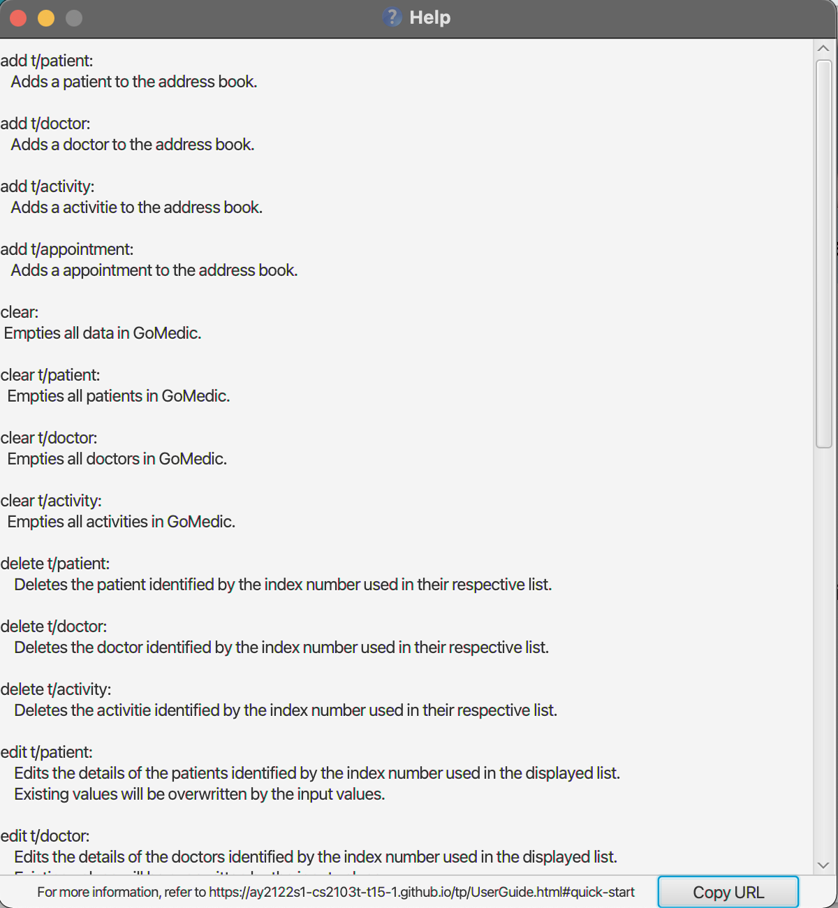

GoMedic is a **cross-platform desktop application written in Java and designed for doctors and medical residents to
manage contacts and patient details**. We aim for GoMedic to be used by someone who can type fast and take advantage of the
optimized features for Command Line Interface.

GoMedic is bootstrapped using SE-EDU Address Book 3 and inherits some of its features such as `clear`, parameter
formatting, etc.

* Table of Contents
{:toc}

--------------------------------------------------------------------------------------------------------------------

# Quick start

1. Ensure you have Java `11` or above installed in your Computer.

2. Download the latest `gomedic.jar` from [here](https://github.com/AY2122S1-CS2103T-T15-1/tp/releases).

3. Copy the file to the folder you want to use as the _home folder_ for your GoMedic.

4. Double-click the file to start the app. The GUI similar to the below should appear in a few seconds. Note how the app
   contains some sample data. 
   

5. Type the command in the command box and press Enter to execute it. e.g. typing **`help`** and pressing Enter will
   open the help window. 
   Some example commands you can try:

    * **`list t/patient`** : Lists all patients.

    * **`add t/patient n/John-Doe a/30 g/M h/174 w/72 b/O p/12345678 m/heart-failure m/diabetes`** : Adds a patient
      named `John Doe` to GoMedic.

    * **`delete t/patient P001`** : Deletes the patient whose id is P001.

    * **`clear`** : Deletes all contacts including patients, doctors, and activities.

    * **`exit`** : Exits the app.
6. **Address Book, GoMedic Address Book, and GoMedic** refers to the same term, which is just the application itself.
7. Refer to the [Features](#features) below for details of each command.

--------------------------------------------------------------------------------------------------------------------

# Features

**:information_source: Notes about the command format:** 

* Any mention of `{command}` refers to one of these values `add`, `delete`, `list`, `edit`, `clear`, `find`, `view`, `help`,
`profile`, `referral`, `help`, `exit`

* Words in `UPPER_CASE` are the parameters to be supplied by the user. 
  e.g. in `add n/NAME`, `NAME` is a parameter which can be used as `add n/John Doe`.

* Words in `LOWER_CASE` are required flags to be written together with the command.  
  e.g. in `add t/activity`, `t/activity` is a flag that must be written as it is and should not be changed or treated as
  a parameter.

* Items in square brackets are optional. 
  e.g. `n/NAME [t/TAG]` can be used as `n/John Doe t/friend` or as `n/John Doe`.

* Items with `…`​ after them can be used multiple times including zero times. 
  e.g. `[t/TAG]…​` can be used as ` ` (i.e. 0 times), `t/friend`, `t/friend t/family` etc.

* Parameters can be in any order. 
  e.g. if the command specifies `n/NAME p/PHONE_NUMBER`, `p/PHONE_NUMBER n/NAME` is also acceptable.

* If a parameter is expected only once in the command but you specified it multiple times, only the last occurrence of
  the parameter will be taken. 
  e.g. if you specify `p/12341234 p/56785678`, only `p/56785678` will be taken.

* Extraneous parameters for commands that do not take in parameters (such as `help`, `list`, `exit` and `clear`) will be
  ignored. 
  e.g. if the command specifies `help 123`, it will be interpreted as `help`.

* `{type}` indicates one of these three values `t/activity`,`t/patient`, `t/doctor` and `{type}_id` means `ACTIVITY_ID` for `{type} = t/activity`

## Patients Related Features

### Adding a new patient's details: `add t/patient`

Adds a new patient into the GoMedic application.

Format: `add t/patient n/NAME a/AGE g/GENDER h/HEIGHT w/WEIGHT b/BLOOD_TYPE p/PHONE_NUMBER [m/MEDICAL_CONDITION]...`

The parameters are :

* `n/NAME` indicates the full name of the patient, first name and last name are separated by `space`.
* `a/AGE` is greater than or equal to 0.
* `g/GENDER` is chosen from one of 3 choices, `M/F/O` where `M` is for Male, `F` is for Female, and `O` is for Others.
* `h/HEIGHT` is the height of patient in centimeters rounded to the nearest integer.
* `w/WEIGHT` is the weight of patient in kilograms rounded to the nearest integer.
* `b/BLOOD_TYPE` is chosen from one of the 4 choices, `A/B/AB/O`.
* `p/PHONE_NUMBER` must be 8-digit Singapore phone number.
* `m/MEDICAL_CONDITION` is the list of patient's past/pre-existing medical conditions. For medical condition that has multiple
  words, use `space` to combine the words, e.g. `heart failure`.

Examples:

* `add t/patient n/John Doe a/30 g/M h/174 w/72 b/O p/12345678 m/heart failure `

### Display full details of a patient: `view t/patient`

Displays the full details of a particular patient.

Format: `view t/patient i/PATIENT_ID`

The parameters are :

* `i/PATIENT_ID` indicates the ID of the patient to be viewed.

Examples:

* `view t/patient i/P001`

### Deleting an existing patient: `delete t/patient`

Deletes a patient from GoMedic.

Format: `delete t/patient PATIENT_ID`

The parameters are :

* `PATIENT_ID` indicates the ID of the patient to be deleted.

Notes:

* Patient ID can be obtained by listing all the patients or searching for a certain patient with available filters. (_See `find` command_)
* Patient ID is **unique** (i.e. every patient will be assigned to a unique ID, hence this guarantees
  1 `delete t/patient` command will not delete 2 patients at once).
* Invalid Patient ID being supplied would be flagged by GoMedic, and do not cause changes to any existing patients.

Examples:

* `delete t/patient P001`

### Updating an existing patient's details: `edit t/patient`

Edits a patient's details from the GoMedic application.

Format: `edit t/patient i/PATIENT_ID [OPTIONAL_PARAMETER]...`

The compulsory parameter is:
* `i/PATIENT_ID` indicates the ID of the patient to be edited.

The optional parameters are:

* `n/NAME` indicates the full name of the patient.
* `a/AGE` is greater than or equal to 0.
* `g/GENDER` is chosen from one of 3 choices, `M/F/O` where `M` is for Male, `F` is for Female, and `O` is for Others.
* `h/HEIGHT` is the height of patient in centimeters rounded to the nearest integer.
* `w/WEIGHT` is the weight of patient in kilograms rounded to the nearest integer.
* `b/BLOOD_TYPE` is chosen from one of the 4 choices, `A/B/AB/O`.
* `p/PHONE_NUMBER` must be 8-digit Singapore phone number.

NOTE: TO COMPLETE - when you edit tags, you will replace all of the current tags
The optional parameters are:
* `o/description` is the list of patient's past/pre-existing medical conditions to be **added**. For medical condition that has
  multiple words, use `space` to combine the words, e.g. `heart failure`. To separate between conditions, use more tags `o/`.
* `do/description` is the list of patient's past/pre-existing medical conditions to be **deleted**. For medical
  condition that has multiple words, use `space` to combine the words, e.g. `heart failure`.

Notes:
* Patient ID can be obtained by listing all the patients or search for a certain patients with available filters.
* Patient ID is **unique** (i.e. every patient will be assigned to a unique ID, hence this guarantees
  1 `delete t/patient` command will not delete 2 patients at once).
* Invalid Patient ID being supplied would be flagged by GoMedic, and do not cause changes to any existing patients.
* Invalid `OPTIONAL_TO_DELETE` conditions supplied would be flagged by GoMedic, and do not cause changes to the existing
  patient.

Examples:

* `edit t/patient i/P123 n/John Doe a/30 g/M`
* `edit t/patient i/P003 n/Tom Doe a/20 g/M h/167 w/61 b/AB p/12341234 do/diabetes`
* `edit t/patient i/P003 n/Tom Doe a/20 g/M h/167 w/61 b/AB p/12341234 o/fever o/headache do/diabetes do/heart feailure`

### Viewing the list of patients `list t/patient`

List all existing patients’ previews in the GoMedic application.

Format: `list t/patient`

Examples:

* `list t/patient`

## Doctors Related Features

### Overview

Doctor related features allow you to store, edit and list details of other doctors.

These could be details of your colleagues, or other acquaintances that are important in your work.

Each doctor is **uniquely** identified by his or her ID in to form `DXXX`, where `XXX` is a 3-digit integer.
Therefore, **GoMedic** considers two doctors with the same details, such as their names, as two distinct and different
doctors, as long as their IDs are different. 

### Adding a new doctor's details: `add t/doctor`

Adds the details of a doctor into **GoMedic**.

Format: `add t/doctor n/NAME p/PHONE_NUMBER de/DEPARTMENT`

**GoMedic** creates a new doctor based on the smallest Doctor ID available. This example is shown [here](#doctor_tutorial),
where a new doctor is added and assigned the ID **D004** and not **D006**.
 
 **NOTE:**
* A new doctor added may not be displayed as the last entry as the table is sorted by ID. 
* If there are any invalid fields specified, as specified [here](#doctor_constraint), the new doctor will not be added.

The parameters are:

Parameters      |  Explanation                                      | Constraints                                          |                
----------------|---------------------------------------------------|----------------------------------------------------- |
`n/NAME`        | the name of the doctor.                           | Must only contain alphanumeric characters            |
`p/PHONE_NUMBER`| the phone number of the doctor.                   | Must be **numeric** and contain at least **3 digits**|
`de/DEPARTMENT` | the title of the activity.                        | Must only contain alphanumeric characters            |

* `n/NAME` indicates the full name of the doctor.
* `p/PHONE_NUMBER` must be a numeric phone number that contains at least 3 digits.
* `de/DEPARTMENT` indicates the doctor's department.

**Example:**

&#8291;1. Type the command `add t/doctor n/Timmy Tom p/98765432 de/neurology` into the command box.

&#8291;2. Press `Enter` and you should see the new entry being made in the Doctor table! 
Note that the table is sorted by ID, hence, in this example, the new entry will not be displayed as the last entry!

&#8291;3. If there are any errors, the command would turn red as shown by **1**. 
In the example below, the user has forgotten to include the **Department** of the doctor. 
Fix the issue and press `Enter` again; The command should work correctly now!

### Deleting an existing doctor: `delete t/doctor`

Deletes a doctor from GoMedic.

Format: `delete t/doctor DOCTOR_ID`

The parameters are:

* `DOCTOR_ID` indicates the ID of the doctor to be deleted.

Notes:

* Doctor ID can be obtained by listing all the doctors or searching for a certain doctor. (_See `list` and `find` command_)
* Doctor ID is **unique** (i.e. every doctor will be assigned to a unique ID, hence this guarantees 1 `delete t/doctor`
  command will not delete 2 doctors at once).
* Invalid Doctor IDs supplied would be flagged by GoMedic, and do not cause changes to any existing doctors.

Examples:

* `delete t/doctor D001`

### Updating an existing doctor: `edit t/doctor`

Edits a doctor's details in GoMedic.

Format: `edit t/doctor i/DOCTOR_ID [OPTIONAL_PARAMETER]...`

The compulsory parameter is:
* `i/DOCTOR_ID` indicates the ID of the doctor to be edited.

The optional parameters are:

* `n/NAME` indicates the full name of the doctor.
* `p/PHONE_NUMBER` must be a numeric phone number that contains at least 3 digits.
* `d/DEPARTMENT` indicates the doctor's department.

**Note: At least one parameter other than the Doctor ID has to be specified, but not all have to be present**
Examples:

* `edit t/doctor i/D123 p/11112222`
* `edit t/doctor i/D101 n/Jone Stone de/orthopaedics`

### Viewing the list of doctors `list t/doctor`

Format: `list t/doctor`

List all existing doctors’ previews in GoMedic.

Examples:

* `list t/doctor`

## Activities Related Features

### Overview 

Activities related features allow you to store, edit and list events and appointments with patients. 

Using activities, you can track down your daily, weekly or even monthly schedules. **GoMedic** would also automatically 
check for any conflicting activities and notify you immediately every time you try to create a new activity or update 
an existing activity.

**:information_source: Notes about the Time format:** 

* There are three accepted datetime formats (GMT+8 24-Hour Time format):
    1. dd/MM/yyyy HH:mm (e.g. 15/09/2022 13:00)
    2. dd-MM-yyyy HH:mm (e.g. 15-09-2022 13:00)
    3. yyyy-MM-dd HH:mm (e.g. 2022-09-15 13:00)

Each activity is **uniquely** identified by its ID in the form `AXXX`, where `XXX` is a 3-digit integer. 
Therefore, two activities with exactly same title and descriptions with different ID are considered distinct. 

---
**Current Activities Related Features That Are Not Supported by GoMedic**

* Creating and editing recurrent events. 
* Associating other doctors for an event.
* Listing the activity in a Calendar style. 

---

**:information_source: Reminder on Command Notation:** 

* Some important notation in reading the commands
    * `[flag/KEYWORD]` indicates optional parameters
    * `flag/KEYWORD` indicates mandatory parameters

### Adding a new activity: `add t/activity`

Adds a new activity into your **GoMedic** scheduler. 

Format: `add t/activity s/START_TIME e/END_TIME ti/TITLE [d/DESCRIPTION]`

**GoMedic** would create a new activity based on the smallest Activity ID available. This example is shown [here](#appointment_tutorial), where
a new activity is being added and get assigned ID **A006** and not **A008** which makes it not displayed at the last entry in the list
as the table is sorted by ID by default.

* GoMedic would check for any partial or full **conflicting activities** if any and notify you immediately. Should there be any,
the current appointment will not be added. 
* GoMedic would also check for any invalid field as specified [here](#activity_constraint). Should there be any, the new activity will not be added. 

The parameters are:

Parameters    |  Explanation                                      | Constraints                                          |                
--------------|---------------------------------------------------|----------------------------------------------------- |
`s/START_TIME`| the starting time of the appointment.             | Refer to [this](#overview)                           |
`e/END_TIME`  | the ending time of the activity.                  | Refer to [this](#overview)                           |
`ti/TITLE`    | the title of the activity.                        | maximum of **60** characters                         |
`d/DESCRIPTION`| the description of the activity.                 | maximum of **500** characters                        |

:exclamation: **Extra Constraints**  

* `START_TIME` must be **strictly less** than `END_TIME`. 

* Partial overlap activity is still considered as conflicting activity.

**Example:**

&#8291;1. Type the command `add t/activity s/2022-09-15 14:00 e/15/09/2022 15:00 ti/Meeting with Mr. X d/about a certain paper` into
the command box.

&#8291;2. Press `Enter` and you should see the new entry being made in the Activity table! By default, the table would be sorted by ID.

&#8291;3. If there is any error, the command would turn red as indicated by **1** and the feedback would be given in the feedback box at **2**.
In this case, the error is because we are using invalid time format, which is in the form of `2022-09-15-14-00`. Fix the issue and press enter again!
Now the command should work correctly!

### Adding a new appointment: `add t/appointment`

Adds a new appointment into your GoMedic scheduler.

Format: `add t/activity i/PATIENT_ID s/START_TIME e/END_TIME ti/TITLE [d/DESCRIPTION]`

An Appointment is still an activity, it just has a single Patient ID associated with it as **GoMedic** currently only supports 
having a one-to-one appointment only. Besides the [checks](#activity_check) performed on usual activity, **GoMedic** would also check
* if the Patient identified by Patient ID exists. If not, GoMedic would immediately notify the user and the new appointment would not be added
to the list. 

The parameters are:

Parameters    |  Explanation                                      | Constraints                                          |                
--------------|---------------------------------------------------|----------------------------------------------------- |
`i/PATIENT_ID`| the Patient Id associated with the appointment    | Patient Id must in the form of `PXXX`, where `XXX` is 3 digit number   |
`s/START_TIME`| the starting time of the appointment.             | Refer to [this](#overview)                           |
`e/END_TIME`  | the ending time of the activity.                  | Refer to [this](#overview)                           |
`ti/TITLE`    | the title of the activity.                        | maximum of **60** characters                         |
`d/DESCRIPTION`| the description of the activity.                 | maximum of **500** characters                        |

The [activity constraints](#activity_extra_constraint) are still applicable here. 

**Example:**

&#8291;1. Type the command `add t/appointment i/P001 s/2022-09-15 14:00 e/15/09/2022 15:00 ti/Appointment with Patient X` into
   the command box.

&#8291;2. Press `Enter` and you should see the new entry being made in the Activity table! By default, the table would be sorted by ID and hence note that 
   the new entry is not displayed at the last entry!

&#8291;3. If there is any error, the command would turn red as shown by **1**. Also, if the patient does not exist as shown by **2**, you need to create the patient using `add t/patient` command. Fix the issue 
and press `Enter` again, the command should work correctly now!

### Deleting an existing activity: `delete t/activity`

Delete a certain existing activity from **GoMedic**. 

Format: `delete t/activity ACTIVITY_ID`

:exclamation: **Caution:**
the `ACTIVITY_ID` does not require additional flags such as `i/`! supplying those flags would render the command invalid!

The parameter is:

Parameters    |  Explanation                                      | Constraints                                          |                
--------------|---------------------------------------------------|----------------------------------------------------- |
`ACTIVITY_ID` | the Activity Id as shown by the Activity table     | Refer to [this](#overview) |

:bulb: **Tip:** Activity ID can be obtained by listing all the activities using [`list t/acitivty` command](#list-all-activities-list-tactivity) 
or search the specific activity using [`find t/activity` command](#finding-entries-find-optional_parameters).  

**Example:**

&#8291;1. Type the command `delete t/activity A001` into the command box.

&#8291;2. Press `Enter` and you will get confirmation that the activity is indeed deleted. Check the activity table and the activity identified by the deleted ID should not be there. 

&#8291;3. If there is any error, the command would turn ren as shown by **1**. Also, the feedback about the error is shown by the 
feedback box shown at **2**. Fix the issue and the command should work correctly now!

### List all activities: `list t/activity`

List all activities that is stored in **GoMedic**.

Format: `list t/activity s/SORT_FLAG p/PERIOD_FLAG`

By default, all activities would be displayed in ascending order of ID. 

* Regardless on the input format of the `start_time` and `end_time` field, it would be displayed in `dd-MM-yyyy HH:mm` GMT+8 24-Hour format.
* Titles and Descriptions that are too long would be truncated. 

The parameters are : 

Parameters    |  Explanation                                                              | Constraints                                          |                
--------------|---------------------------------------------------------------------------|----------------------------------------------------- |
`s/SORT_FLAG`  | Options to sort the activity table by a certain column (case-insensitive)                 | - **START** : sort by start time   - **ID** : sort by ID
`p/PERIOD_FLAG`| Options to show the activities within the specified time frame (case-insensitive)           | - **ALL** : show all activities   - **TODAY** : show today's activities   - **WEEK** : show all activities within the next week    - **MONTH** : show all activities within the next month   - **YEAR** : show all activities within the next year

**Example:**

&#8291;1. Type the command `list t/activity p/today` into the command box. For example, the today's date is 28 October 2021. Note that the flag is case-insensitive!

&#8291;2. Press `Enter` and the success confirmation should be shown by the feedback box as shown by **1**. Realize that as shown by **2**, the activity table only shows today's activities.

&#8291;3. If there is any error, the command would turn ren as shown by **1**. Also, the feedback about the error is shown by the
   feedback box shown at **2**. Please check that the flags available are only those specified in constraints [above](#list-all-activities-list-tactivity)! Fix the issue and the command should work correctly now!

### Reordering Columns in The Display Table 

:bulb: **Tip:** You can reorder the column to suit your preference by dragging the title as shown by the following picture

&#8291;1. Left click and hold any header of the table, the column would turn blue and can be dragged.

&#8291;2. Drag the header into the location of other columns as indicated as **1**, the column would be inserted at the line indicated by **2**.

&#8291;3. Release the left click, and the columns should be reordered now!

## Finding entries: `find [OPTIONAL_PARAMETERS]...`

### Find results that contain keyword: `find t/CATEGORY [OPTIONAL_PARAMETERS]...`

Searches for doctors, patients and activities that contain the specified keyword as a substring in any of their details.
If more than 1 keyword is specified, results that contain at least 1 of the keywords will be returned (i.e. `OR` search)
E.g. `Hans Bo` will return `Hans Gruber`, `Bo Yang`

Users can specify additional optional parameters to limit the keyword matching to the fields that is associated with each
flag. Parameters will only match results that contain the associated field (E.g. n/Hans will not return any `activities`
since `activities` do not have a `name` field.)

Format: `find t/CATEGORY [OPTIONAL_PARAMETERS]...`

The parameters are:
* `t/CATEGORY`: Searches for matches within this category.
    * Valid values are:
        * doctor
        * patient
        * activity
        * all

The optional parameters are:

* `n/NAME`: Matches the name field (Valid for: `Patients`, `Doctors`)
* `p/PHONE_NUMBER`: Matches the phone number field (Valid for: `Patients`, `Doctors`)
* `a/AGE`: Matches the age field (Valid for: `Patients`)
* `g/GENDER`: Matches the gender field; The only valid keywords for this field are `M/F/O` (Valid for: `Patients`)
* `h/HEIGHT`: Matches the height field (Valid for: `Patients`)
* `w/WEIGHT`: Matches the weight field (Valid for: `Patients`)
* `b/BLOOD_TYPE`: Matches the blood type field; The only valid keywords for this field are `A/B/AB/O`
  (Valid for: `Patients`)
* `o/MEDICAL_CONDITION`: Limits the keyword search to the list of medical conditions of a patient (Valid
  for: `Patients`)
* `de/DEPARTMENT`: Matches the department field (Valid for: `Doctors`)
* `ti/TITLE`: Matches the title field or description field (Valid for: `Activities`)
* `ta/TAG_DESCRIPTION`: Matches results that contain the specified tag in its list of tags (Valid for: `Activities`,
  _Tagging for `Doctors` and `Patients` coming soon_)

* `all/KEYWORD` : Matches any field with the keyword specified

Note:
* Keyword is case-insensitive for convenience (“dia” will match diabetic patients even if the user stored the patient's
  condition as “Diabetes”)
* Parameters can be repeated (e.g. `find n/Hans n/Bo` will return both `Hans Gruber` and `Bo Yang`)
* If the optional parameters `all` is  specified, the keyword will match any fields. E.g. `find t/all all/dia` will return:
    1. Doctor Claudia, whose name matches `dia`
    2. Patient Jaryl, whose medical condition, `diabetes`, matches `dia`
    3. Doctor Tom, whose specialty, `Pediatrics`, matches `dia`
    4. Patient Lydia, whose name matches `dia`

Examples:

* `find t/all o/diabetes a/42 n/Jaryl`
* `find t/activity ta/important ti/tutorial`
* `find t/all all/dia`

## General Utility Commands 

### Generating a referral: `referral`

Generates a referral letter for a patient in PDF format.

Format: `referral ti/TITLE di/DOCTOR_ID pi/PATIENT_ID [d/DESCRIPTION]`

The parameters are:

* `ti/TITLE` title of the referral document.
* `di/DOCTOR_ID` id of the doctor to be referred to.
* `pi/PATIENT_ID` id of the patient being referred.
* `d/DESCRIPTION` description of the patient's condition and further details.

Note: 

* the patient and doctor must both be present in the GoMedic App as a valid entry or the referral will not be
generated.

### Customizing your own profile: `profile`

Updates your profile on GoMedic.

Format: `profile n/NAME p/POSITION de/DEPARTMENT o/ORGANIZATION`

The parameters are:
* `n/NAME` the name of the user.
* `p/POSITION` the position held by the user. (E.g. Senior Consultant)
* `de/DEPARTMENT` the department that the user works in. (E.g. Department of Cardiology)
* `o/ORGANIZATION` the organization that the user works in. (E.g. National University Hospital)

Note:
* All parameters must be alphanumeric. Otherwise, it would be considered as an 
invalid entry, and the command will not be executed.

Example:
* `profile n/Jon Snow p/Senior Consultant de/Department of Cardiology o/NUH`
* `profile n/Joan Saow p/Consultant de/Department of Neurology o/TTSH`

### Viewing help : `help`

Shows a message giving a brief explanation of each command term and the ability to copy the link to the user guide for 
more information.

Format: `help`

### Clearing all entries : `clear [{type}]`

Clears all entries from the address book related to the specified type. If there is no type that is specified, all the data would be cleared.

Format: `clear [{type}]`

Examples: 

* `clear t/patient`: Clears all patient entries and the appointments associated with them
* `clear t/doctor`: Clears all doctor entries
* `clear t/activity`: Clears all activity and appointment entries
* `clear`: Clears all entries in GoMedic

### Exiting the program : `exit`

Exits the program.

Format: `exit`

### Suggestions

There are two types of erroneous inputs that we are expecting, one for single worded commands and one for two word commands.
Behaviour of each erroneous command is assumed to follow the convention specified above.

There will be up to 5 suggested commands for each erroneous input.

#### For errors that follow the format `{mispelt command}`:

* errors such as `exi` will return `exit`,`edit t/patient`,`edit t/doctor`,`edit t/activity` ranked using a word similarity metric.

* for such errors, single word commands like `help` or two word commands like `add t/patient` may be suggested.

#### For errors that follow the format `{command} {mispelt type}`, `{mispelt command} {type}` or `{mispelt command} {mispelt type}`:

* errors such as `adl t/patit` will return `add t/patient`, `add t/activity` ranked using a word similarity metric.

* for such errors, only two word commands like `add t/patient` can be suggested.

### Saving the data

GoMedic saves the data on the hard disk automatically after every command. There is no need to save manually.

### Editing the data file

Currently, all the data are saved as a JSON file `[JAR file location]/data/addressbook.json`. Advanced users are welcome
to update data directly by editing that data file.

In the subsequent releases, the patient data can be found at `[JAR file location]/data/patients.json`, doctors data
at `[JAR file location]/data/doctors.json`, and finally all activities at `[JAR file location]/data/activities.json`

:exclamation: **Caution:**
If your changes to the data file makes its format invalid, GoMedic will discard all data and start with an empty data file at the next run.
If the format for the user profile is invalid, the preset user profile will be used instead.

--------------------------------------------------------------------------------------------------------------------

# FAQ

**Q**: How do I transfer my data to another Computer? 
**A**: Install the app in the other computer and overwrite the empty data file it creates with the file that contains
the data of your previous GoMedic home folder.

--------------------------------------------------------------------------------------------------------------------

# Command summary
* `{PARAMETERS}` indicates the mandatory and optional parameters as specified in the [Features](#features) section.

Action        | Format                                            | Examples                                             |                
--------------|---------------------------------------------------|----------------------------------------------------- |
**Add**       | `add {type} {PARAMETERS}`                         | `add t/doctor n/Timmy Tom p/98765432 de/neurology`   |
**Delete**    | `delete {type} {type}_ID`                         | `delete t/patient P003`                              |
**Edit**      | `edit {type} i/{type}_ID ...`                     | `edit t/patient i/P123 n/John Doe a/30 g/M`          |
**Find**      | `find {type} ...`                                 | `find ta/important ti/tutorial`                      |
**View**      | `view t/patient i/PATIENT_ID`                     | `view t/patient i/P003`                              |
**Referral**  | `referral {PARAMETERS}`                           | `referral ti/Referral of Patient A di/D001 pi/P001`  |
**Clear**     | `clear` or `clear {type}`                         | `clear t/activity`                                   |
**List**      | `list {type} {PARAMETERS}`                        | `list t/patient`, `list t/activity s/START`          |
**Exit**      | `exit`                                            |                                                      |
**Help**      | `help`                                            |                                                      |

