# **Introduction**


GoMedic is a **cross-platform desktop application written in Java and designed for doctors and medical residents to
manage contacts and patient details**. We aim for GoMedic to be used by someone who can type fast and take advantage of the
optimized features for Command Line Interface.

GoMedic is bootstrapped using SE-EDU Address Book 3 and inherits some of its features such as `clear`, parameter
formatting, etc.

<div markdown="block" class="alert alert-info">
**:information_source: Best Way To Read This User Guide:**<br>
It is best to open this User Guide using **e-pdf** reader as it allows you to click the header of each section that would 
conveniently bring you to the [table of content](#table-of-contents)!
</div>

<div style="page-break-after: always;"></div>

# **Table of Contents**

* Table of Contents
{:toc}

<div style="page-break-after: always;"></div>

# [**1. How To Use This Guide**](#table-of-contents)

This user guide provides information to assist you in using **GoMedic** based on which features you are most interested in. 
The user guide is sectioned such that each chapter [has](#table-of-contents) an 
* **Overview** : Explains what the feature does and provides some important reminders about the notations used in that particular chapter
* **Features** : List of commands available within that section 
  * **Format** : List of fields that need to be supplied for that particular command
  * **Parameters** : Explanation about each field, together with its constraints
  * **Examples** : Tutorial with pictures on how to use the commands. 

<div markdown="span" class="alert alert-info">
:bulb: **Tip:** You can always go back to the table of content page and just click on which feature you are currently interested at, as each feature has a very comprehensive tutorial !
</div>

To get the most out of this user guide, it would be best to understand the terminologies and notations that would often be used in this user guide. 

Don't worry if you forget some [notations](#12-about-the-commands) along the way, you can always check this chapter or the **Overview** section to find 
the important notations that are used in that chapter. 

## [1.1 How GoMedic Looks Like](#table-of-contents)

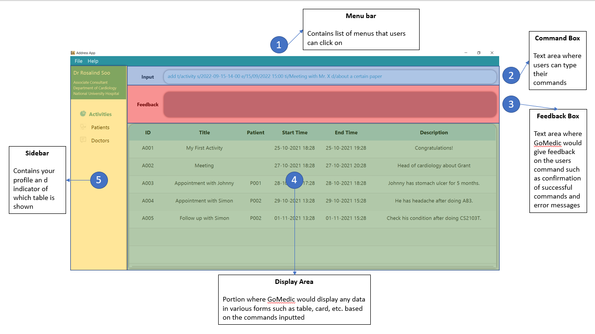

## [1.2 About the Commands](#table-of-contents)
<div markdown="block" class="alert alert-info">

**:information_source: Understanding The Notations:**<br>

* Words in `UPPER_CASE` are the parameters to be supplied by the user.<br>
  e.g. in `add n/NAME`, `NAME` is a parameter which can be used as `add n/John Doe`.

* Items in square brackets are optional.<br>
  e.g. `n/NAME [t/TAG]` can be used as `n/John Doe t/friend` or as `n/John Doe`.

* Items with `…`​ after them can be used multiple times including zero times.<br>
  e.g. `[m/MEDICAL_CONDITION]…​` can be used as ` ` (i.e. 0 times), `m/diabetes`, `m/fever m/flu` etc.

* Parameters can be in any order.<br>
  e.g. if the command specifies `n/NAME p/PHONE_NUMBER`, `p/PHONE_NUMBER n/NAME` is also acceptable.

* If a parameter is expected only once in the command but you specified it multiple times, only the last occurrence of
  the parameter will be taken.<br>
  e.g. if you specify `p/12341234 p/56785678`, only `p/56785678` will be taken.

* Extraneous parameters for commands that do not take in parameters (such as `help` and `exit`) will be
  ignored.<br>
  e.g. if the command specifies `help 123` or `help x/123`, it will be interpreted as `help`.
  
* Any whitespaces inserted before and after the parameter value will be removed. <br>
  E.g. Let `\s` represent a whitespace. If parameter is specified as `p/\s\s98765432\s\s`, 
  the value will be treated as `98765432`, without the leading and trailing whitespaces.

</div>

<div style="page-break-after: always;"></div>

## [1.3. Error Messages](#table-of-contents)

1. Should you enter an **invalid** command that **GoMedic** cannot recognize, **GoMedic** will
return some suggestions on the closest commands that you can choose from!

   * For example, as `list` command is not available, **GoMedic** will return you the closest commands available which are 
   `list t/acitivty`, `list t/patient`, and `list t/doctor`. 

    To understand more how the suggestion works, please refer to [this](#42-suggestions) section.

2. Should you enter a **valid** command that GoMedic recognizes, but in an **invalid** format (such as a command with missing parameters),
**GoMedic** would highlight the command in red and show the correct command usage in the feedback box. 

3. Should you enter a **valid** command in a **valid** format, but with invalid parameters, 
**GoMedic** would flag the invalid parameter in the feedback box.
   * Invalid parameters can be caused by constraints' violation, such as inputting blood type X for a patient, where such blood type does not exist.
   * If multiple parameters are invalid, GoMedic only flags the first invalid parameter so as to not overwhelm you with the error messages!

<div markdown="span" class="alert alert-primary">
:bulb: **Tip:** To fix the multiple parameters' errors in a command, you can fix them one by one based on the feedback that **GoMedic** give and use the [navigation](#41-navigating-past-commands) feature to get the previous command!
</div>

<div style="page-break-after: always;"></div>

# [**2. Quick start**](#table-of-contents)

1. Ensure you have Java `11` or above installed in your Computer.

2. Download the latest `gomedic.jar` from [here](https://github.com/AY2122S1-CS2103T-T15-1/tp/releases).

3. Copy the file to the folder you want to use as the _home folder_ for your GoMedic.

    * Double-click the file to start the app. If it's not possible, open the terminal and set the current directory to the directory that `gomedic.jar` resides in.
      Enter the command `java -jar gomedic.jar`. If you still find difficulties in opening the `gomedic.jar` file, please follow the steps [here](#5-faq)!
    * A GUI, similar to the one shown below, should appear in a few seconds. Note how the app
      contains some sample data.<br>
      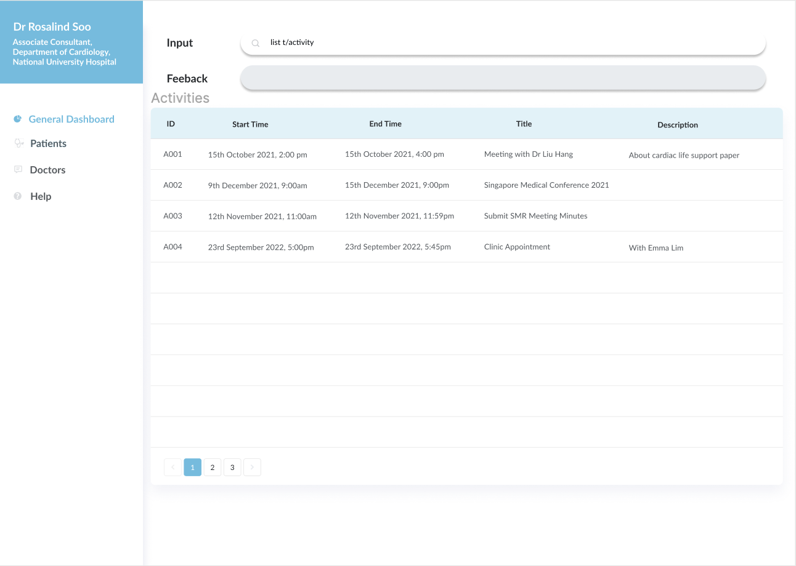

4. Type the command in the command box and press Enter to execute it. E.g. typing **`help`** and pressing Enter will
   open the help window.<br>
   Some example commands you can try:

    * **`list t/patient`** : Lists all patients.

    * **`add t/patient n/John Doe a/30 g/M h/174 w/72 b/O p/12345678 m/heart-failure m/diabetes`** : Adds a patient
      named `John Doe` to GoMedic.

    * **`delete t/patient P001`** : Deletes the patient whose id is P001.

    * **`clear`** : Deletes all contacts including patients, doctors, and activities.

    * **`exit`** : Exits the app.
5. **Address Book, GoMedic Address Book, and GoMedic** refers to the same term, which is just the application itself.
6. Refer to the [Features](#3-gomedic-features) below for details of each command.

<div style="page-break-after: always;"></div>

# [**3. GoMedic Features**](#table-of-contents)

## [**3.1 Patients Related Features**](#table-of-contents)

### [3.1.1 Overview](#table-of-contents)
Patients related features allow you to store, edit, view, and list patients.

Using patients, you can store your patients' details and track all medical conditions that your patients are
diagnosed with.

Each patient is **uniquely** identified by its `PATIENT_ID` in the form of `PXXX` where `XXX` is a 3-digit integer.
Therefore, two patients with exactly same `NAME`, `PHONE_NUMBER`, `AGE`, `GENDER`, `HEIGHT`, `WEIGHT`, `BLOOD_TYPE`, 
and `MEDICAL_CONDITIONS` with different `PATIENT_ID` are considered distinct.

<div markdown="block" class="alert alert-info">
**:information_source: Reminder on Command Notation:**<br>

* Some important notation in reading the commands
    * `[flag/KEYWORD]` indicates optional parameters
    * `flag/KEYWORD` indicates mandatory parameters
</div>

<div style="page-break-after: always;"></div>

### [3.1.2 Adding a new patient: `add t/patient`](#table-of-contents)

Adds a new patient into your **GoMedic** application.

**Format**: `add t/patient n/NAME p/PHONE_NUMBER a/AGE g/GENDER h/HEIGHT w/WEIGHT b/BLOOD_TYPE [m/MEDICAL_CONDITION]...`

**GoMedic** would create a new patient based on the smallest `PATIENT_ID` available.

<a name="patient_check"></a>

* GoMedic would check for any invalid parameters as specified [here](#patient_constraint). Should there be any, the new
patient will not be added.

The parameters are :

<a name="patient_constraint"></a>

Parameters    |  Explanation                                      | Constraints                                          |                
--------------|---------------------------------------------------|----------------------------------------------------- |
`n/NAME`      | full name of the patient                          | must only contain alphanumeric characters and spaces, and it should not be blank|
`p/PHONE_NUMBER`| phone number of the patient                     | must be **entirely numeric** and exactly 8 digits long|
`g/GENDER`    | gender of the patient                             | must be `M/F/O` where `M` is for Male, `F` is for Female, and `O` is for Others, all non capitalized letters will be capitalized, e.g. `m` input will be treated as `M`|
`h/HEIGHT`    | height of the patient in centimeters              | must be integer between 1 and 300 inclusive          |
`w/WEIGHT`    | weight of the patient in kilograms                | must be integer between 1 and 700 inclusive          |
`b/BLOOD_TYPE`| blood type of the patient                         | must be `A+/A-/B+/B-/AB+/AB-/O+/O-`, all non capitalized letters will be capitalized, e.g. `a+` input will be treated as `A+`|
`m/MEDICAL_CONDITION`| list of patient's past/pre-existing medical conditions| must only contain alphanumeric characters and spaces, with maximum of *30* characters|

<a name="patient_extra_constraint"></a>

<div markdown="block" class="alert alert-warning">

:exclamation: **Extra Constraints** <br>

* `MEDICAL_CONDITION` is **unique**.
* Duplicates of the same `MEDICAL_CONDITION` provided will be discarded.

</div>

**Example:**

&#8291;1. Type the command `add t/patient n/John Smith p/98765432 a/45 b/AB g/M h/175 w/70 m/heart failure m/diabetes` into
the command box.

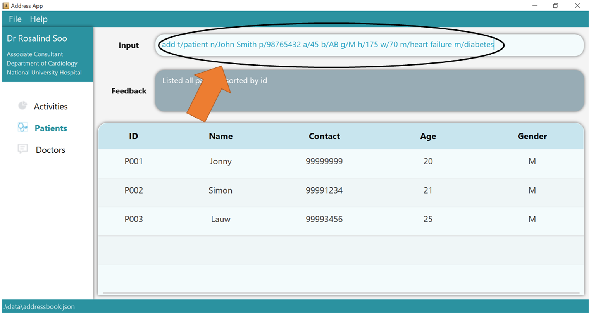

<div style="page-break-after: always;"></div>

&#8291;2. Press `Enter` and you should see the new entry being made in the Patient table! By default, the table would be sorted by ID.

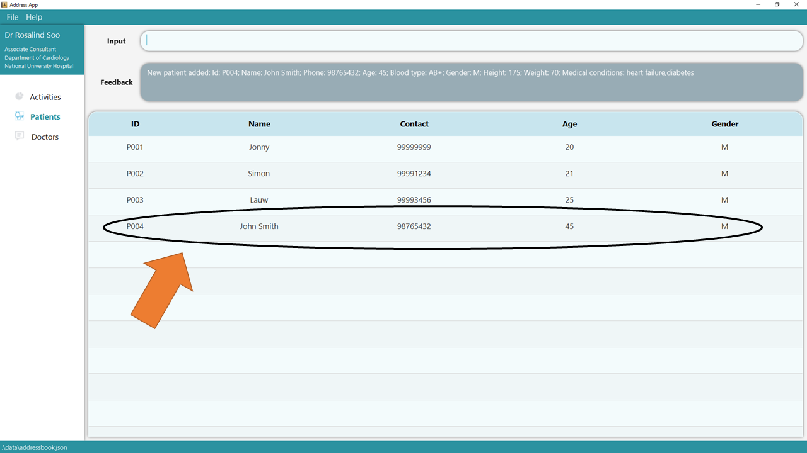

&#8291;3. If there is any error, the command would turn red as indicated by **1** and the feedback would be given in the feedback box at **2**.
In this case, the error is because we are putting invalid gender. Fix the issue and press enter again!
Now the command should work correctly!

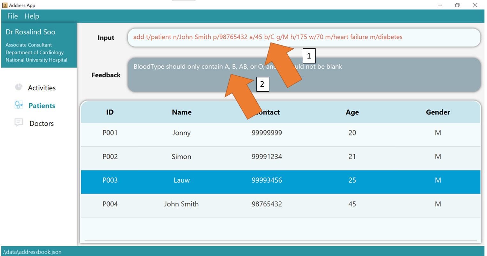

To understand better how **GoMedic** classifies the error messages, please refer to [this](#13-error-messages) section.

<div style="page-break-after: always;"></div>

### [3.1.3 Deleting an existing patient: `delete t/patient`](#table-of-contents)

Deletes an existing patient from **GoMedic**.

**Format**: `delete t/patient PATIENT_ID`

The parameter is:

Parameters    |  Explanation                                      | Constraints                                          |                
--------------|---------------------------------------------------|----------------------------------------------------- |
`PATIENT_ID`  | the Patient Id as shown by the Patient table  (case-insensitive)    | Must be in the form of `PXXX` / `pXXX` where `XXX` is 3-digit integer. For the full information, please refer to [this](#311-overview) |

<div markdown="span" class="alert alert-info">
:bulb: **Tip:** Patient ID can be obtained by listing all the patients using [`list t/patient` command](#314-list-all-patients-list-patient)
or search the specific patient using [`find t/patient` command](#344-finding-a-patient-through-a-keyword-find-tpatient).
</div>

**Example:**

&#8291;1. Type the command `delete t/patient P001` into the command box.


<div style="page-break-after: always;"></div>

&#8291;2. Press `Enter` and you will get confirmation that the patient is indeed deleted. Check that the patient, identified by his/her deleted ID, should not be there.

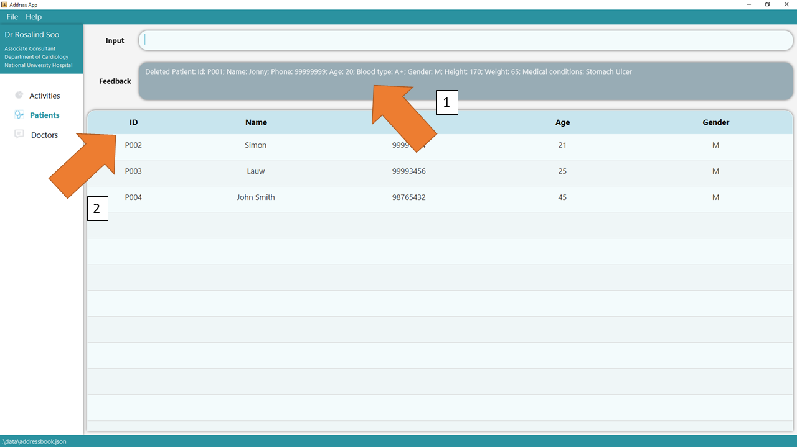

&#8291;3. If there are any errors, the command would turn red as shown by **1**. Also, feedback about the error is shown in the
feedback box shown at **2**. Fix the issue and the command should work correctly now!

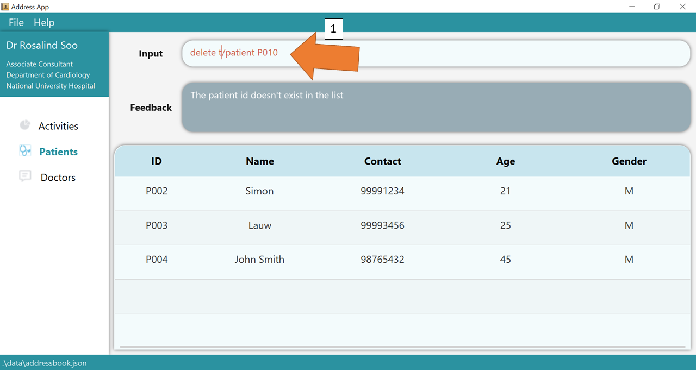

To understand better how **GoMedic** classifies the error messages, please refer to [this](#13-error-messages) section.

<div style="page-break-after: always;"></div>

### [3.1.4 List all patients: `list t/patient`](#table-of-contents)

List all patients that are stored in **GoMedic**.

**Format**: `list t/patient`

**Example:**

&#8291;1. Type the command `list t/patient` into the command box and press `Enter`. The success confirmation should be shown by the feedback box as shown by **1**. 
GoMedic will display the Patient Table, as seen by **2**.

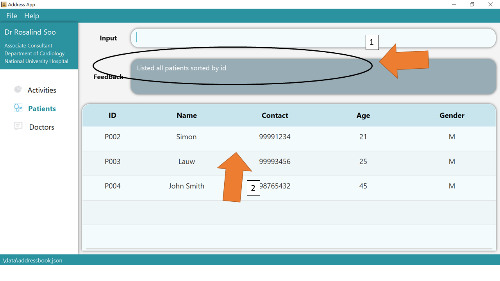

<div style="page-break-after: always;"></div>

### [3.1.5 Updating an existing patient's details: `edit t/patient`](#table-of-contents)

Edits a patient's details in **GoMedic**.

**Format**: `edit t/patient i/PATIENT_ID [OPTIONAL_PARAMETERS]...`

<div markdown="block" class="alert alert-warning">:exclamation: **Caution:**
* The `PATIENT_ID` is assigned by **GoMedic** and cannot be modified at all once created.

* The `MEDICAL_CONDITIONS` will be replaced by the new `MEDICAL_CONDITIONS` supplied in the edit command.
</div>

<div markdown="span" class="alert alert-info">
:bulb: **Tip:** You can update multiple fields at the same time !
</div>

The parameters are:

Parameters    |  Explanation                                      | Constraints                                          |                
--------------|---------------------------------------------------|----------------------------------------------------- |
`i/PATIENT_ID`| the unique identifier of a patient (case-insensitive)               | must be in the form of `PXXX` / `pXXX` where `XXX` is 3-digit integer. For the full information, please refer to [this](#311-overview)|
`n/NAME`      | full name of the patient                          | must only contain alphanumeric characters and spaces, and it should not be blank|
`a/AGE     `  | age of the patient                                | must be integer between 0 and 150 inclusive          |
`p/PHONE_NUMBER`| phone number of the patient                     | must be **entirely numeric** and exactly 8 digits long|
`g/GENDER`    | gender of the patient                             | must be `M/F/O` where `M` is for Male, `F` is for Female, and `O` is for Others, all non capitalized letters will be capitalized, e.g. `m` input will be treated as `M`|
`h/HEIGHT`    | height of the patient in centimeters              | must be integer between 1 and 300 inclusive          |
`w/WEIGHT`    | weight of the patient in kilograms                | must be integer between 1 and 700 inclusive          |
`b/BLOOD_TYPE`| blood type of the patient                         | must be `A+/A-/B+/B-/AB+/AB-/O+/O-`, all non capitalized letters will be capitalized, e.g. `a+` input will be treated as `A+`|
`m/MEDICAL_CONDITION`| list of patient's past/pre-existing medical conditions| must only contain alphanumeric characters and spaces, with maximum of *30* characters|

**Example:**

&#8291;1. Type the command `edit t/patient i/P002 n/John Snow p/91234567 a/30 b/AB g/M h/185 w/85 m/cancer` into the command box. 
Ensure that the edited patient, as identified by his/her `PATIENT_ID`, exists!


&#8291;2. Press `Enter` and the success confirmation should be shown by the feedback box as shown by **1**. As shown by **2**, patient `P002` has his information updated!

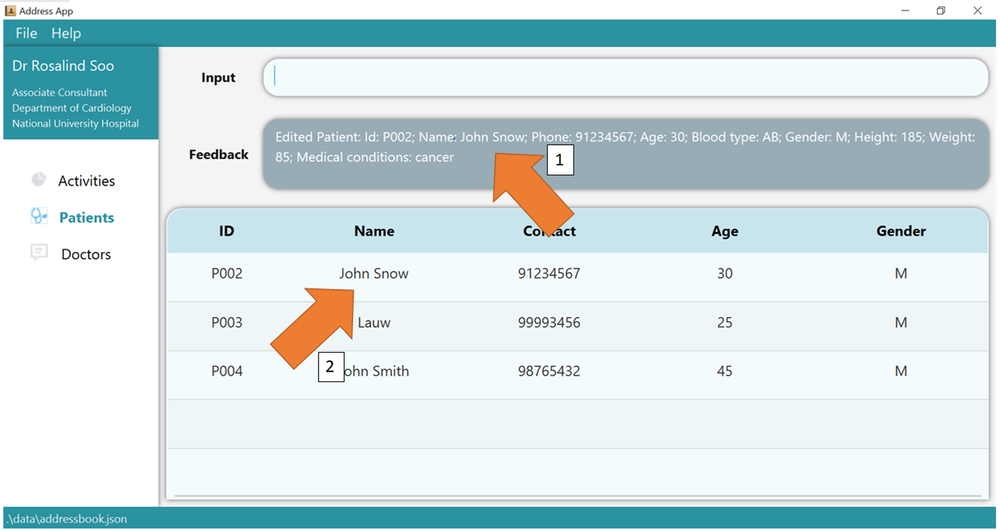

&#8291;3. If there are any errors, the command would turn red as shown by **1**. Also, feedback about the error will be shown by the feedback box, as seen by **2**.
In this case, the error is caused by an invalid gender supplied to the `GENDER` parameter. Fix the issue and the command should work correctly now!

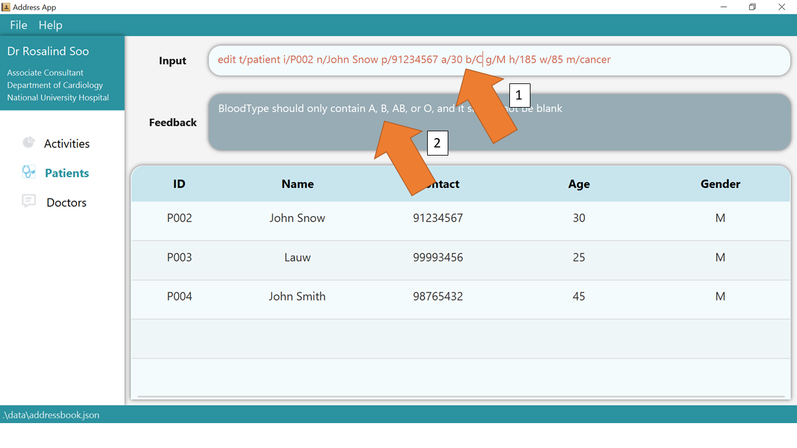

To understand better how **GoMedic** classifies the error messages, please refer to [this](#13-error-messages) section.

<div style="page-break-after: always;"></div>

### [3.1.6 Display full details of a patient: `view t/patient`](#table-of-contents)

Displays the full details of a particular patient.

Format: `view t/patient PATIENT_ID`

The parameter is:

Parameters    |  Explanation                                      | Constraints                                          |                
--------------|---------------------------------------------------|----------------------------------------------------- |
`PATIENT_ID`  | the Patient Id as shown by the Patient table (case-insensitive)     | Must be in the form of `PXXX` / `pXXX` where `XXX` is 3-digit integer. For the full information, please refer to [this](#311-overview) |

<div markdown="span" class="alert alert-info">
:bulb: **Tip:** `PATIENT_ID` can be obtained by listing all the patients using [`list t/patient` command](#314-list-all-patients-list-patient)
or searching for the specific patient using [`find t/patient` command](#342-finding-a-doctor-through-a-keyword-find-tdoctor).
</div>

**Example:**

&#8291;1. Type the command `view t/patient` into the command box.

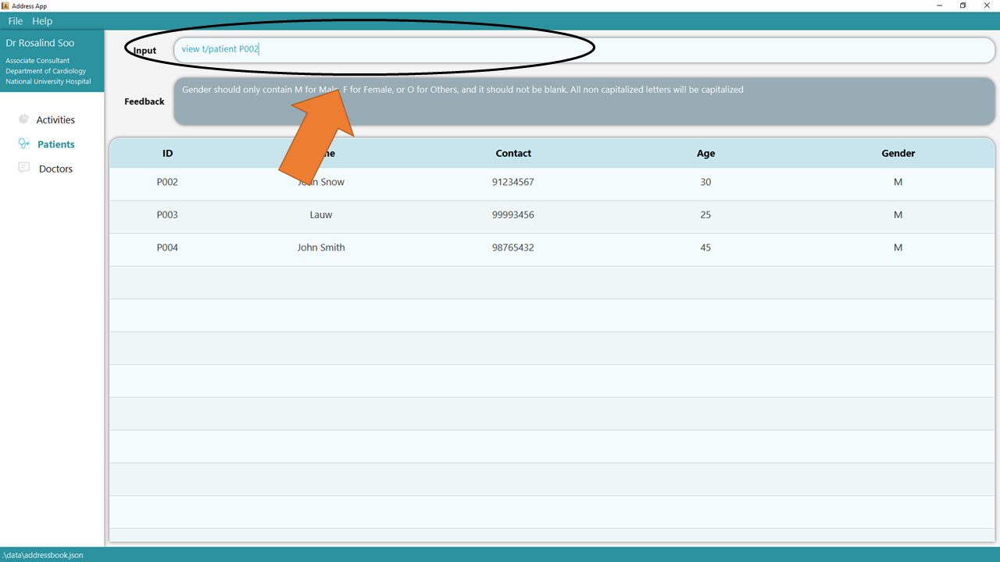

<div style="page-break-after: always;"></div>

&#8291;2. Press `Enter` and the details of the patient will be shown in the screen.

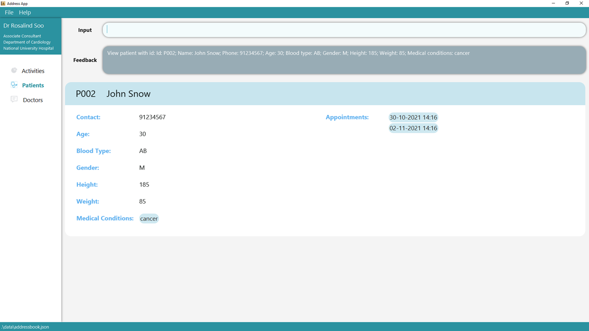

<div style="page-break-after: always;"></div>

### [3.1.7 Clear all patient entries: `clear t/patient`](#table-of-contents)

Clears all patient entries from GoMedic.

Format: `clear t/patient`

**Example:**

&#8291;1. Type the command `clear t/patient` into the command box. Press `Enter` and all the patients will be deleted.

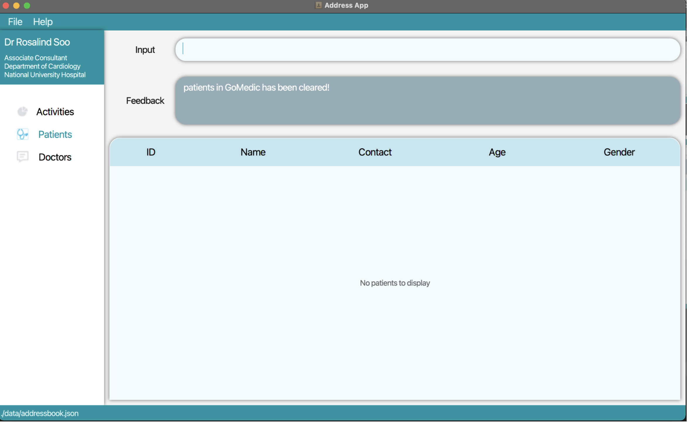

<div markdown="block" class="alert alert-info"> :exclamation: **Warning**:
This will also delete all corresponding appointments since there are no more patients in GoMedic. 
See more about appointments [here](#333-adding-a-new-appointment-add-tappointment)
</div>

<div style="page-break-after: always;"></div>

## [**3.2 Doctors Related Features**](#table-of-contents)

### [3.2.1 Overview](#table-of-contents)

Doctor related features allow you to store, edit and list details of other doctors.

These could be details of your colleagues, or other acquaintances that are important in your work.

Each doctor is **uniquely** identified by his or her `DOCTOR_ID` in the form `DXXX`, where `XXX` is a 3-digit integer.
Therefore, **GoMedic** considers two doctors with the same details (same `NAME`, `PHONE_NUMBER` and `DEPARTMENT`), 
as two distinct and different doctors, as long as their `DOCTOR_ID`s are different.

<div markdown="block" class="alert alert-info">
**:information_source: Reminder on Command Notation:**<br>

* Some important notation in reading the commands
    * `[flag/KEYWORD]` indicates optional parameters
    * `flag/KEYWORD` indicates mandatory parameters
</div>

<div style="page-break-after: always;"></div>

### [3.2.2 Adding a new doctor's details: `add t/doctor`](#table-of-contents)

Adds the details of a doctor into **GoMedic**.

**Format**: `add t/doctor n/NAME p/PHONE_NUMBER de/DEPARTMENT`

**GoMedic** creates a new doctor based on the smallest Doctor ID available. This example is shown [here](#doctor_tutorial),
where a new doctor is added and assigned the ID **D004** instead of **D006**.
 
**NOTE:**
* A new added doctor may not be displayed as the last entry, as the table is sorted by ID. 
* If there are any invalid parameters, as specified [here](#doctor_constraint), the new doctor will not be added.

The parameters are:

<a name="doctor_constraint"></a>

Parameters      |  Explanation                                      | Constraints                                          |                
----------------|---------------------------------------------------|----------------------------------------------------- |
`n/NAME`        | the name of the doctor.                           | must only contain alphanumeric characters and spaces, and it should not be blank|
`p/PHONE_NUMBER`| the phone number of the doctor.                   | must be **entirely numeric** and exactly 8 digits long                          |
`de/DEPARTMENT` | the department of the doctor.                     | must only contain alphanumeric characters and spaces, and it should not be blank|

<div style="page-break-after: always;"></div>

<a name="doctor_tutorial"></a>
**Example:**

&#8291;1. Type the command `add t/doctor n/Timmy Tom p/98765432 de/neurology` into the command box.

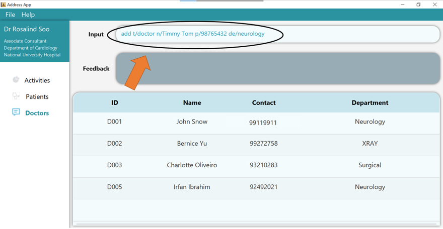

&#8291;2. Press `Enter` and you should see the new entry being made in the Doctor table! 
Note that the table is sorted by ID. Hence, in this example, the new entry will not be displayed as the last entry!

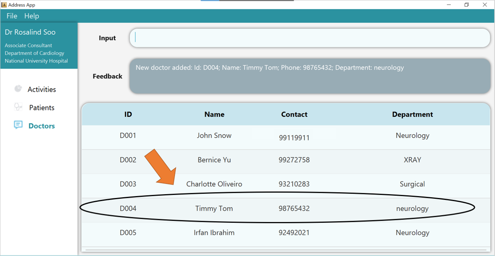

<div style="page-break-after: always;"></div>

&#8291;3. If there are any errors, the command would turn red as shown by **1**. 
In the example below, the user has forgotten to include the `DEPARTMENT` of the doctor. 
Fix the issue by following the command format, shown in **2**, and press `Enter` again; The command should work correctly now!

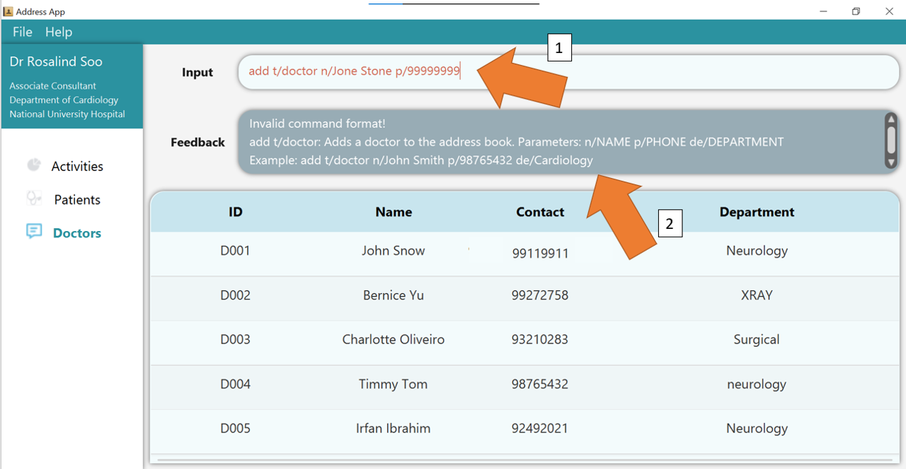

To understand better how **GoMedic** classifies the error messages, please refer to [this](#13-error-messages) section.

<div style="page-break-after: always;"></div>

### [3.2.3 Deleting an existing doctor: `delete t/doctor`](#table-of-contents)

Deletes an existing doctor from GoMedic.

**Format**: `delete t/doctor DOCTOR_ID`

<div markdown="span" class="alert alert-warning">:exclamation: **Caution:**
the `DOCTOR_ID` does not require additional flags such as `i/`! Supplying those flags would render the command invalid!
</div>

The parameter is:

Parameter     |  Explanation                                      | Constraint                                           |                
--------------|---------------------------------------------------|----------------------------------------------------- |
`DOCTOR_ID`   | the Doctor Id as shown by the Doctor table (case-insensitive)       | Must be in the form of `DXXX` / `dXXX` where `XXX` is 3-digit integer. For the full information, please refer to [this](#321-overview) |

<div markdown="span" class="alert alert-info">
:bulb: **Tip:** Doctor ID can be obtained by listing all the doctors using [`list t/doctor` command](#324-list-all-doctors-list-tdoctor) 
or searching for the specific doctor using [`find t/doctor` command](#342-finding-a-doctor-through-a-keyword-find-tdoctor).  
</div>

**Example:**

&#8291;1. Type the command `delete t/doctor D001` into the command box.

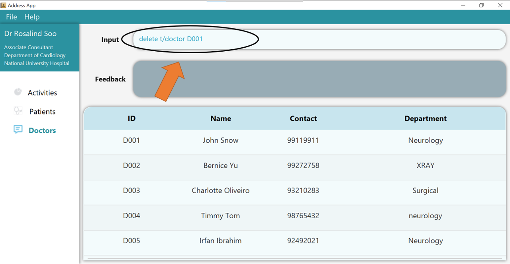

<div style="page-break-after: always;"></div>

&#8291;2. Press `Enter` and you will get confirmation that the doctor is indeed deleted. 
Check the doctor table. The doctor, identified by his/her deleted ID, should not be there. 

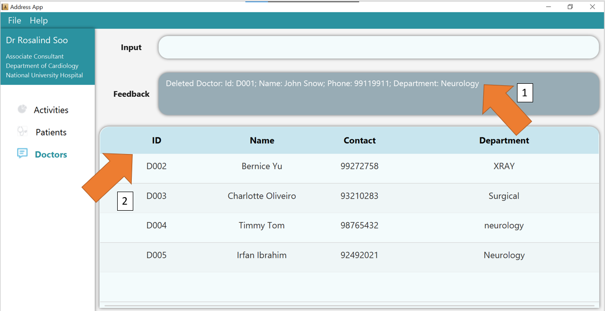

&#8291;3. If there are any errors, the command would turn red as shown by **1**. Also, feedback about the error is displayed in the  
feedback box, as seen by **2**. Fix the issue and the command should work correctly now!

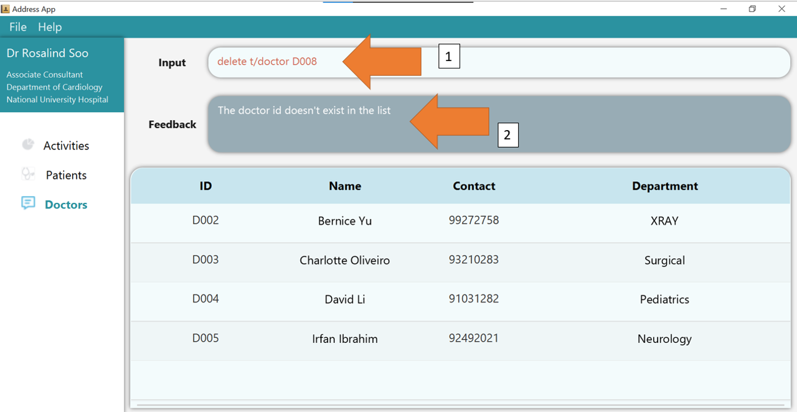

To understand better how **GoMedic** classifies the error messages, please refer to [this](#13-error-messages) section.

<div style="page-break-after: always;"></div>

### [3.2.4 List all doctors: `list t/doctor`](#table-of-contents)

List all doctors that are stored in **GoMedic**.

**Format**: `list t/doctor`

**Example:**

&#8291;Type the command `list t/doctor` into the command box. Press `Enter` and the list of doctors will be displayed, as shown below.

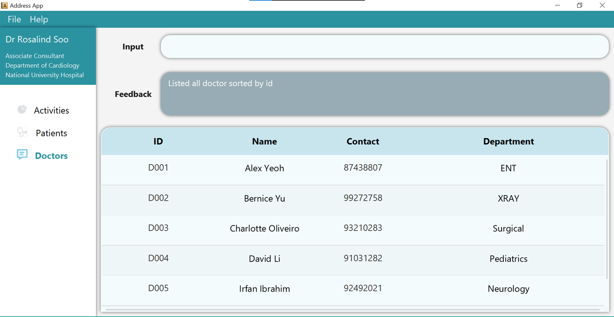

<div style="page-break-after: always;"></div>

### [3.2.5 Updating an existing doctor's details: `edit t/doctor`](#table-of-contents)

Edits a doctor's details in **GoMedic**.

**Format**: `edit t/doctor i/DOCTOR_ID [OPTIONAL_PARAMETERS]...`

When editing an existing doctor, all parameters are optional except `DOCTOR_ID`! However, 
* If there are no parameters being supplied at all besides the `DOCTOR_ID`, **GoMedic** would return an error. 
* The new information supplied to the `edit t/doctor` command would still need to conform to the constraints as stated [above](#doctor_constraint).

<div markdown="block" class="alert alert-warning">:exclamation: **Caution:**

The `DOCTOR_ID` is assigned by **GoMedic** and cannot be modified at all once created.
</div>

<div markdown="span" class="alert alert-info">
:bulb: **Tip:** You can update multiple fields at the same time!
</div>

The parameters are:

Parameters      |  Explanation                                      | Constraints                                          |                
----------------|---------------------------------------------------|----------------------------------------------------- |
`i/DOCTOR_ID`   | the unique identifier of a doctor (case-insensitive). | Must be in the form of `DXXX` / `dXXX` where `XXX` is 3-digit integer. For the full information, please refer to [this](#321-overview)                           |
`n/NAME`        | the name of the doctor.                           | Must only contain alphanumeric characters and spaces, and it should not be blank|
`p/PHONE_NUMBER`| the phone number of the doctor.                   | Must be **entirely numeric** and exactly 8 digits long                          |
`de/DEPARTMENT` | the department of the doctor.                     | Must only contain alphanumeric characters and spaces, and it should not be blank|

<div style="page-break-after: always;"></div>

**Example:**

&#8291;1. Type the command `edit t/doctor i/D002 de/Radiology` into the command box. Ensure that the edited doctor, as identified by his or her `DOCTOR_ID`, exists! 

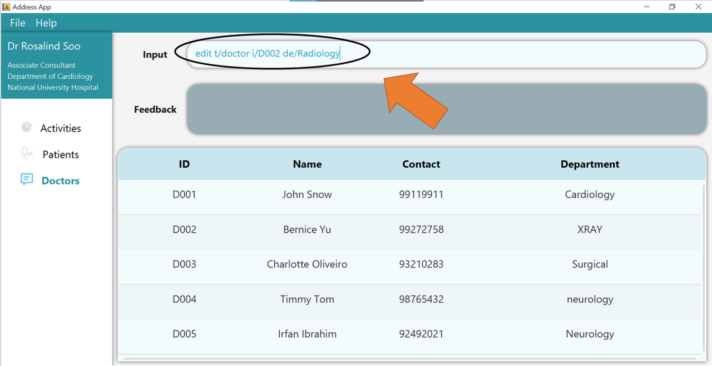

&#8291;2. Press `Enter` and the success confirmation should be shown by the feedback box as shown by **1**. 
As shown by **2**, doctor `D002`, Bernice, has her department updated!

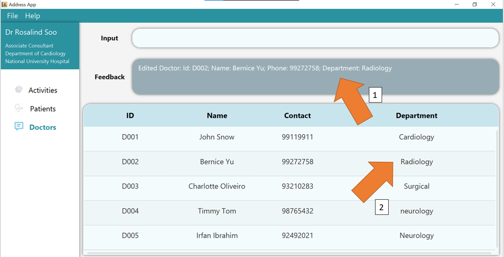

<div style="page-break-after: always;"></div>

&#8291;3. If there are any errors, the command would turn red as shown by **1**. Also, feedback about the error displayed in the 
feedback box, as seen by **2**. In this case, the error is that the `NAME` of the edited doctor contains `*`, which is an illegal character.
Fix the issue and the command should work correctly now!

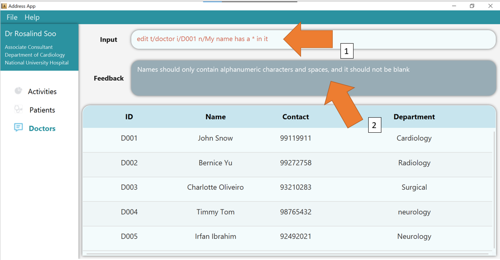

To understand better how **GoMedic** classifies the error messages, please refer to [this](#13-error-messages) section.

<div style="page-break-after: always;"></div>

### [3.2.6 Clear all doctor entries: `clear t/doctor`](#table-of-contents)

Clears all doctor entries from GoMedic.

Format: `clear t/doctor`

**Example:**

&#8291;1. Type the command `clear t/doctor` into the command box. Press `Enter` and all the doctors will be deleted.

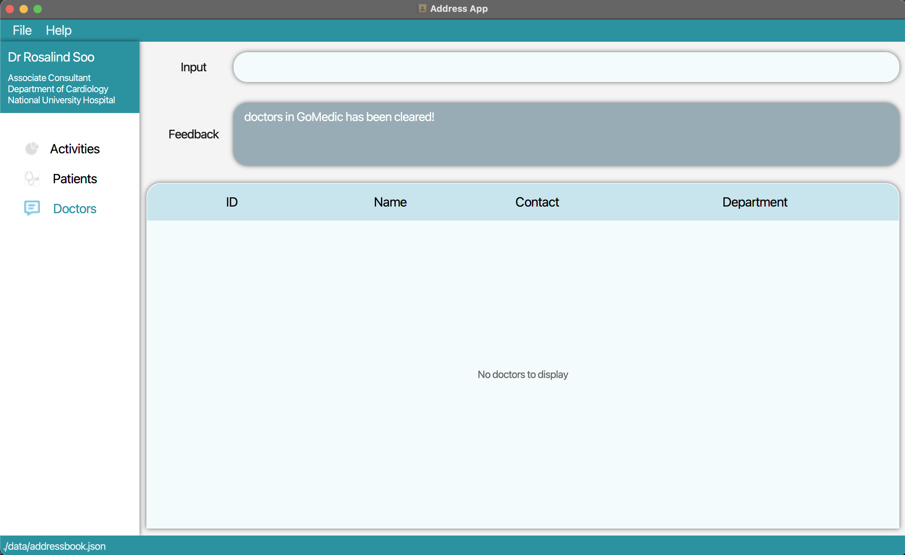

<div style="page-break-after: always;"></div>

## [**3.3 Activities Related Features**](#table-of-contents)

### [3.3.1 Overview](#table-of-contents)

Activities related features allow you to add, delete, edit and list events and appointments with patients. 

Using activities, you can track down your daily, weekly or even monthly schedules. **GoMedic** will also automatically 
check for any conflicting activities and notify you immediately everytime you try to create a new activity or update 
an existing activity.

<div markdown="block" class="alert alert-info">
**:information_source: Notes about the Time format:**<br>

* There are three accepted datetime formats (GMT+8 24-Hour Time format):
    1. dd/MM/yyyy HH:mm (e.g. 15/09/2022 13:00)
    2. dd-MM-yyyy HH:mm (e.g. 15-09-2022 13:00)
    3. yyyy-MM-dd HH:mm (e.g. 2022-09-15 13:00)
</div>

Each activity is **uniquely** identified by its `ACTIVITY_ID` in the form of `AXXX` where `XXX` is a 3-digit integer. 
Therefore, two activities with exactly same `TITLE` and `DESCRIPTION` with different `ACTIVITY_ID` are considered distinct.

---
**Current Activities Related Features That Are Not Supported by GoMedic**

* Creating and editing recurrent events. 
* Associating other doctors for an event.
* Listing the activity in a Calendar style. 

---

<div markdown="block" class="alert alert-info">
**:information_source: Reminder on Command Notation:**<br>

* Some important notation in reading the commands
    * `[flag/KEYWORD]` indicates optional parameters
    * `flag/KEYWORD` indicates mandatory parameters
</div>

<div style="page-break-after: always;"></div>

### [3.3.2 Adding a new activity: `add t/activity`](#table-of-contents)

Adds a new activity into your **GoMedic** scheduler. 

**Format**: `add t/activity s/START_TIME e/END_TIME ti/TITLE [d/DESCRIPTION]`

**GoMedic** will create a new activity based on the smallest `ACTIVITY_ID` available. This example is shown [here](#appointment_tutorial), where
a new activity added is assigned the ID **A006** instead of **A008**. This means that this new activity is not displayed as the last entry in the list, 
as the table is sorted by `ACTIVITY_ID` by default.

<a name="activity_check"></a>

* GoMedic will check for any partial or full **conflicting activities** and notify you immediately if there are any. Should there be any,
the new activity will not be added. 
* GoMedic will also check for any invalid parameters as specified [here](#activity_constraint). Should there be any, the new activity will not be added. 

The parameters are:

<a name="activity_constraint"></a>

Parameters    |  Explanation                                      | Constraints                                          |                
--------------|---------------------------------------------------|----------------------------------------------------- |
`s/START_TIME`| the starting time of the appointment.             | Should be a valid datetime in a valid format specified [here](#331-overview)                           |
`e/END_TIME`  | the ending time of the activity.                  | Should be a valid datetime in a valid format specified [here](#331-overview)                           |
`ti/TITLE`    | the title of the activity.                        | maximum of **60** characters                         |
`d/DESCRIPTION`| the description of the activity.                 | maximum of **500** characters                        |

<a name="activity_extra_constraint"></a>

<div markdown="block" class="alert alert-warning">

:exclamation: **Extra Constraints** <br>

* `START_TIME` must be **strictly less** than `END_TIME`. 

* Activities with partially overlapping times are still considered as conflicting activities.

</div>

<div style="page-break-after: always;"></div>

**Example:**

&#8291;1. Type the command `add t/activity s/2022-09-15 14:00 e/15/09/2022 15:00 ti/Meeting with Mr. X d/about a certain paper` into
the command box.

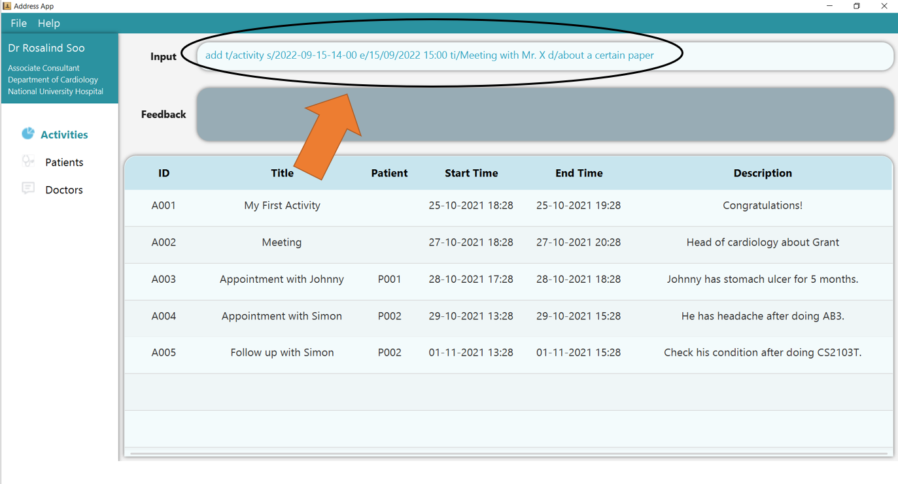

&#8291;2. Press `Enter` and you should see the new entry being made in the Activity table! By default, the table would be sorted by ID.

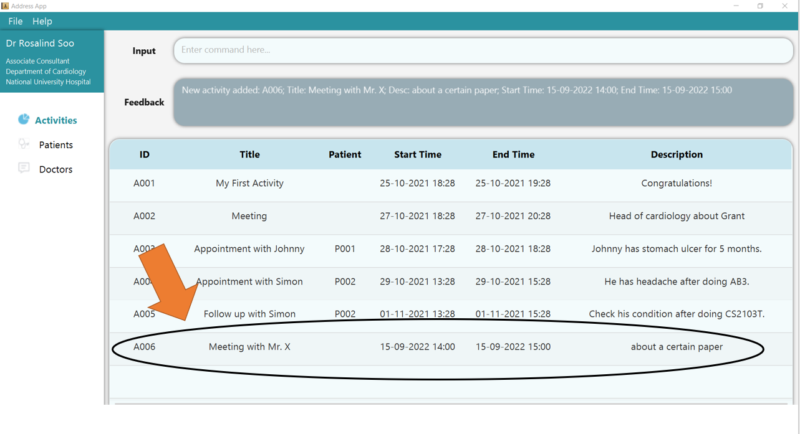

<div style="page-break-after: always;"></div>

&#8291;3. If there are any errors, the command would turn red as indicated by **1** and feedback would be given in the feedback box, as seen by **2**.
In this case, the error caused by an invalid time format, in the form `2022-09-15-14-00`, being supplied to `START_TIME`. Fix the issue and press enter again!
Now the command should work correctly!

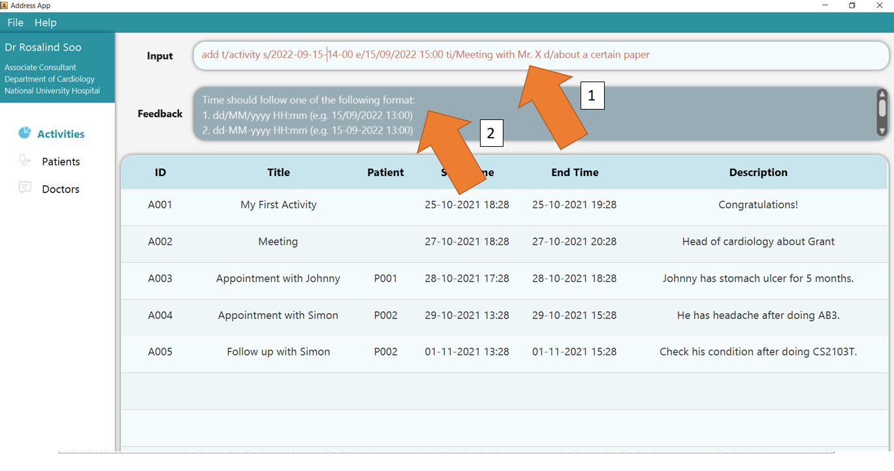

To understand better how **GoMedic** classifies the error messages, please refer to [this](#13-error-messages) section.

<div style="page-break-after: always;"></div>

### [3.3.3 Adding a new appointment: `add t/appointment`](#table-of-contents)

Adds a new appointment into your GoMedic scheduler.

**Format**: `add t/activity i/PATIENT_ID s/START_TIME e/END_TIME ti/TITLE [d/DESCRIPTION]`

An Appointment is a type of Activity, with an additional parameter `PATIENT_ID` associated with it. Currently, **GoMedic** only supports 
one-to-one appointments. Besides the [checks](#activity_check) performed on usual activity, **GoMedic** would also check
* if the Patient identified by his/her `PATIENT_ID` exists. If not, GoMedic will immediately notify the user and the new appointment will not be added
to the list. 

The parameters are:

Parameters    |  Explanation                                      | Constraints                                          |                
--------------|---------------------------------------------------|----------------------------------------------------- |
`i/PATIENT_ID`| the Patient Id associated with the appointment    | Patient Id must in the form of `PXXX` / `pXXX`, where `XXX` is 3 digit number   |
`s/START_TIME`| the starting time of the appointment.             | Should be a valid datetime in a valid format specified [here](#331-overview)                           |
`e/END_TIME`  | the ending time of the activity.                  | Should be a valid datetime in a valid format specified [here](#331-overview)                           |
`ti/TITLE`    | the title of the activity.                        | maximum of **60** characters                         |
`d/DESCRIPTION`| the description of the activity.                 | maximum of **500** characters                        |

The [activity constraints](#activity_extra_constraint) are still applicable here. 

<div style="page-break-after: always;"></div>

<a name="appointment_tutorial"></a>
**Example:**

&#8291;1. Type the command `add t/appointment i/P001 s/2022-09-15 14:00 e/15/09/2022 15:00 ti/Appointment with Patient X` into
   the command box.


&#8291;2. Press `Enter` and you should see the new entry being made in the Activity table! By default, the table would be sorted by ID. Hence, note that 
   the new entry is not displayed as the last entry!

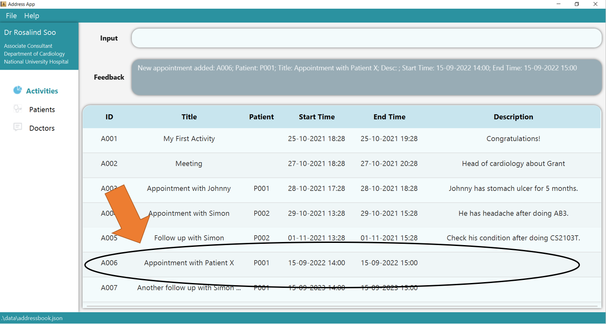

<div style="page-break-after: always;"></div>

&#8291;3. If there are any errors, the command will turn red as shown by **1**. 
Furthermore, if the patient does not exist, as shown by **2**, the user needs to create the patient first, using the `add t/patient` command. 
Fix the issue and press `Enter` again, the command should work correctly now!

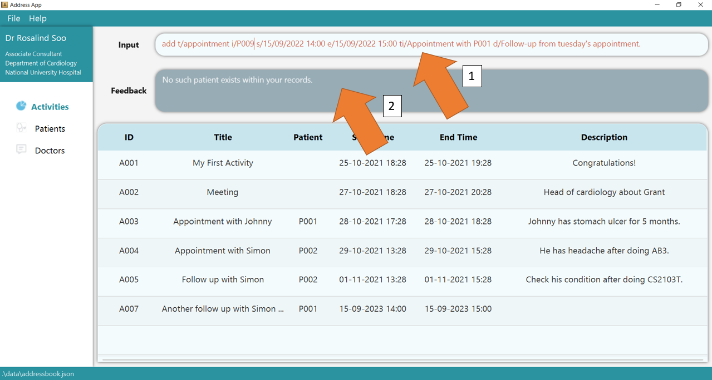

To understand better how **GoMedic** classifies the error messages, please refer to [this](#13-error-messages) section.

<div style="page-break-after: always;"></div>

### [3.3.4 Deleting an existing activity: `delete t/activity`](#table-of-contents)

Delete an existing activity from **GoMedic**. 

**Format**: `delete t/activity ACTIVITY_ID`

<div markdown="span" class="alert alert-warning">:exclamation: **Caution:**
the `ACTIVITY_ID` does not require additional flags such as `i/`! Supplying those flags would render the command invalid!
</div>

The parameter is:

Parameter     |  Explanation                                      | Constraint                                           |                
--------------|---------------------------------------------------|----------------------------------------------------- |
`ACTIVITY_ID` | the Activity Id as shown by the Activity table (case-insensitive)  | Must be in the form of `AXXX` / `aXXX` where `XXX` is 3-digit integer. For the full information, please refer to [this](#331-overview) |

<div markdown="span" class="alert alert-info">
:bulb: **Tip:** `ACTIVITY_ID` can be obtained by listing all the activities using [`list t/activity` command](#335-list-all-activities-list-tactivity) 
or searching for the specific activity using [`find t/activity` command](#343-finding-an-activity-through-a-keyword-find-tactivity).  
</div>

**Example:**

&#8291;1. Type the command `delete t/activity A001` into the command box.

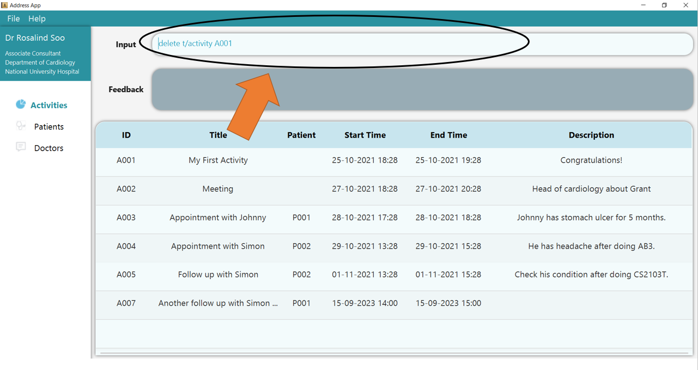

&#8291;2. Press `Enter` and you will get confirmation that the activity is indeed deleted. Check the activity table. The activity, identified by its deleted ID, should not be there. 


&#8291;3. If there are any errors, the command will turn red as shown by **1**. Also, feedback about the error is displayed in the  
feedback box, as seen by **2**. Fix the issue and the command should work correctly now!

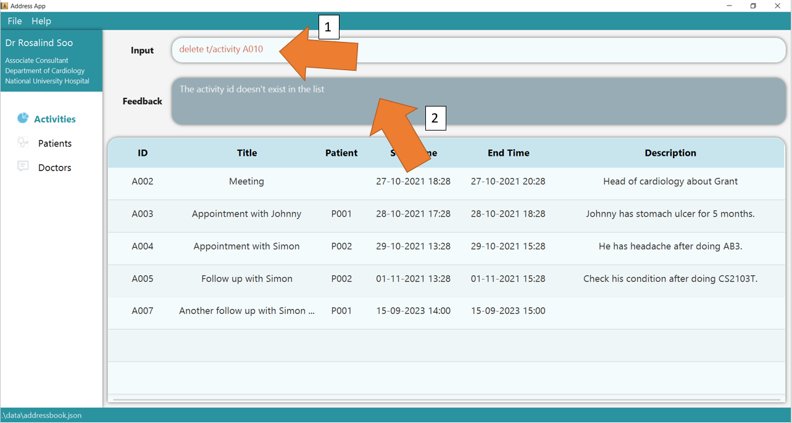

To understand better how **GoMedic** classifies the error messages, please refer to [this](#13-error-messages) section.

<div style="page-break-after: always;"></div>

### [3.3.5 List all activities: `list t/activity`](#table-of-contents)

Lists all activities that is stored in **GoMedic**.

**Format**: `list t/activity s/SORT_FLAG p/PERIOD_FLAG`

By default, all activities will be displayed in ascending order of ID. 

* Regardless on the input format of the `START_TIME` and `END_TIME` field, it will be displayed in `dd-MM-yyyy HH:mm` GMT+8 24-Hour format.
* Titles and Descriptions that are too long will be truncated. 

The parameters are : 

Parameters    |  Explanation                                                              | Constraints                                          |                
--------------|---------------------------------------------------------------------------|----------------------------------------------------- |
`s/SORT_FLAG`  | Options to sort the activity table by a certain column (case-insensitive)                 | - **START** : sort by start time <br/> - **ID** : sort by ID
`p/PERIOD_FLAG`| Options to show the activities within the specified time frame (case-insensitive)           | - **ALL** : show all activities <br/> - **TODAY** : show today's activities <br/> - **WEEK** : show all activities within the next week  <br/> - **MONTH** : show all activities within the next month <br/> - **YEAR** : show all activities within the next year

<div style="page-break-after: always;"></div>

**Example:**

&#8291;1. Type the command `list t/activity p/today` into the command box. In this example, `today` refers to the date 28 October 2021. Note that the flag is case-insensitive!


&#8291;2. Press `Enter` and the success confirmation should be shown by the feedback box as shown by **1**. As shown by **2**, the activity table only shows today's activities.

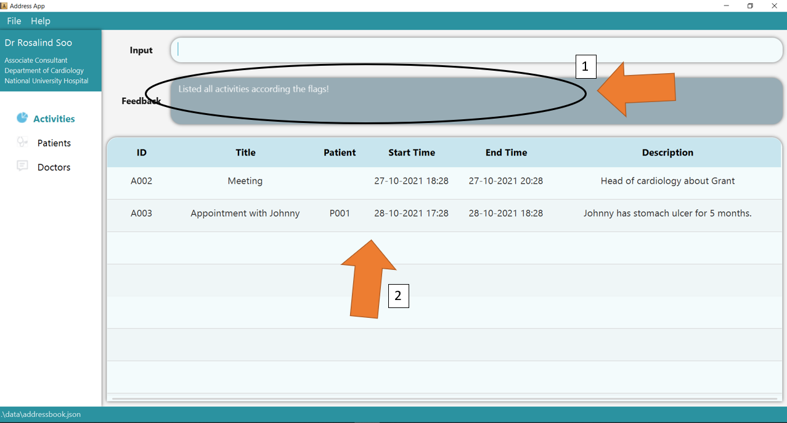

<div style="page-break-after: always;"></div>

&#8291;3. If there are any errors, the command will turn red as shown by **1**. Also, feedback about the error is displayed in the
   feedback box, as seen by **2**. Check that the flags supplied are only from the list of available ones specified in constraints [above](#335-list-all-activities-list-tactivity)! Fix the issue and the command should work correctly now!

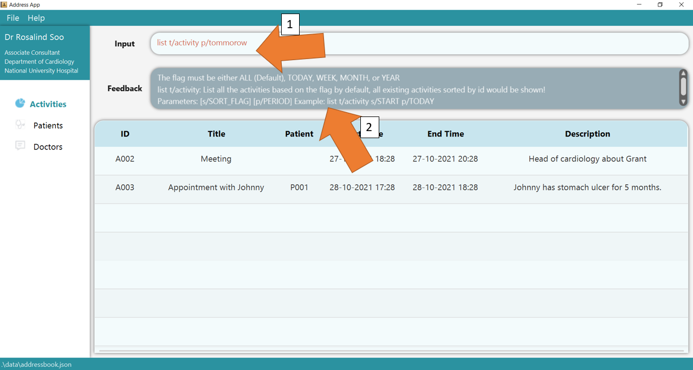

To understand better how **GoMedic** classifies the error messages, please refer to [this](#13-error-messages) section.

<div style="page-break-after: always;"></div>

### [3.3.6 Updating an existing activity's details: `edit t/activity`](#table-of-contents)

Edits an activity's details from the **GoMedic** application.

**Format**: `edit t/activity i/ACTIVITY_ID [OPTIONAL PARAMETERS]...`

When editing an existing activity, all parameters are optional except `ACTIVITY_ID`! However, 
* If there are no parameters being supplied other than `ACTIVITY_ID`, **GoMedic** will return an error. 
* **GoMedic** will check for any conflicting activities when the `START_TIME` or the `END_TIME` is modified. 

<div markdown="block" class="alert alert-warning">:exclamation: **Caution:**
* The `PATIENT_ID` of an appointment cannot be modified! You need to delete and create a new appointment to modify the `PATIENT_ID`
* The `ACTIVITY_ID` is also assigned by **GoMedic** and cannot be modified at all once created.
</div>

<div markdown="span" class="alert alert-info">
:bulb: **Tip:** You can update multiple fields at the same time !
</div>

The parameters are: 

Parameters    |  Explanation                                      | Constraints                                          |                
--------------|---------------------------------------------------|----------------------------------------------------- |
`i/ACTIVITY_ID`| the unique identifier of an activity (case-insensitive).            | Must be in the form of `AXXX` / `aXXX` where `XXX` is 3-digit integer. For full info, please refer to [this](#331-overview)                           |
`s/START_TIME`| the starting time of the appointment.             | Should be a valid datetime in a valid format specified [here](#331-overview)                           |
`e/END_TIME`  | the ending time of the activity.                  | Should be a valid datetime in a valid format specified [here](#331-overview)                           |
`ti/TITLE`    | the title of the activity.                        | maximum of **60** characters                         |
`d/DESCRIPTION`| the description of the activity.                 | maximum of **500** characters                        |

<div style="page-break-after: always;"></div>

**Example:**

&#8291;1. Type the command `edit t/activity i/A002 ti/My Edited Activity` into the command box. Ensure that the edited activity, as identified by its `ACTIVITY_ID`, exists! 

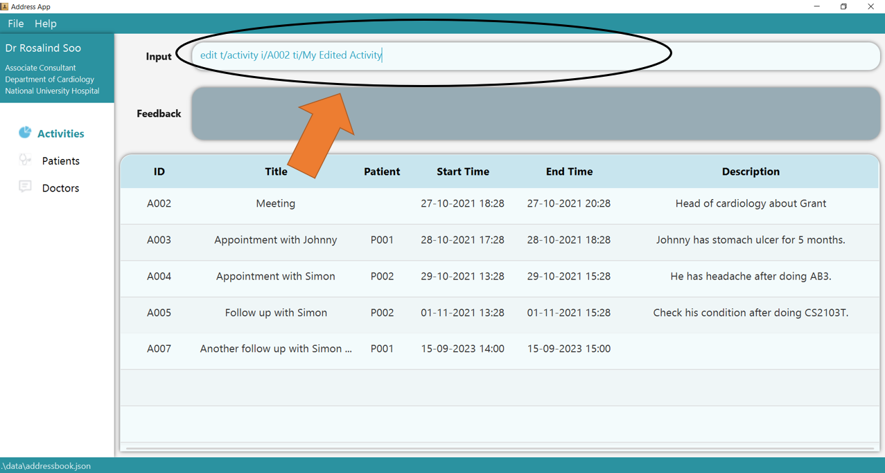

&#8291;2. Press `Enter` and the success confirmation should be displayed in the feedback box, as seen by **1**. As shown by **2**, activity `A002` has its title updated!

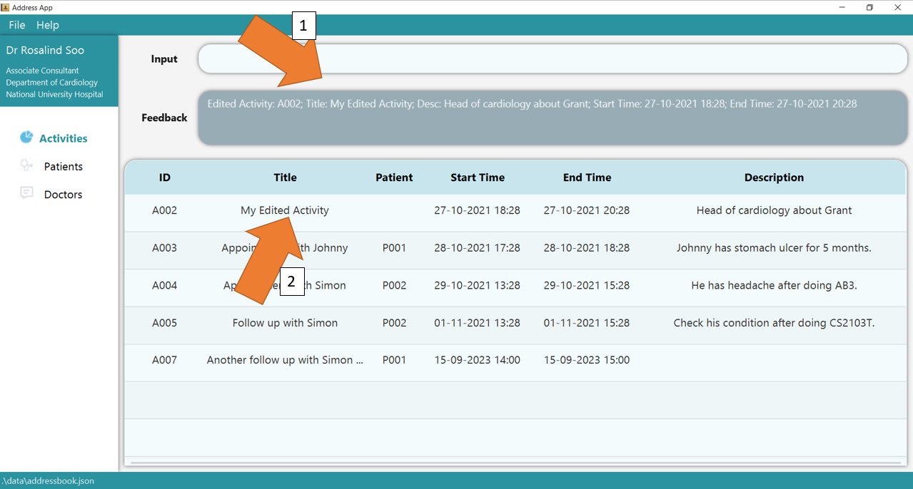

<div style="page-break-after: always;"></div>

&#8291;3. If there are any errors, the command will turn red as shown by **1**. Also, feedback about the error is displayed in the
feedback box shown at **2**. In this case, the error is that `START_TIME` of the edited activity is later than its `END_TIME`. Fix the issue and the command should work correctly now!

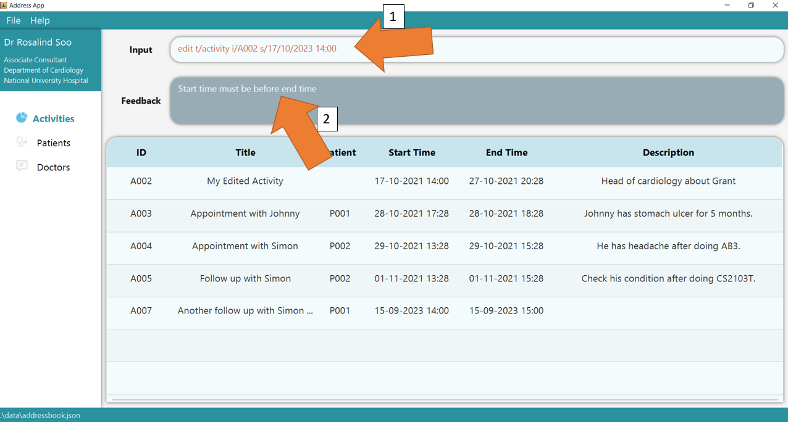

To understand better how **GoMedic** classifies the error messages, please refer to [this](#13-error-messages) section.

<div style="page-break-after: always;"></div>

### [3.3.7 Clear all activity and appointment entries: `clear t/activity`](#table-of-contents)

Clears all activities and appointment entries from GoMedic.

Format: `clear t/activity`

**Example:**

&#8291;1. Type the command `clear t/activity` into the command box. Press `Enter` and all the appointments and activities will be deleted.


<div style="page-break-after: always;"></div>

## [**3.4. Finding entries**](#table-of-contents)

### [3.4.1 Overview](#table-of-contents)
The find feature allows you to search for entries based on user input by matching
the input string with the user-specified fields.

The model that is being searched must be specified too - doctor, patient or activity.

For all find functions, the Keyword is case-insensitive for convenience (“dia” will match diabetic patients even if the user stored the patient's
  condition as “Diabetes”)

The constraints of the field are not checked with the user input. For example, if the user enters
```find t/doctor p/hello```, GoMedic will not throw an error saying that phone number must be
8 digits only. GoMedic will simply display that there are no matching entries where the phone number
field in a doctor contains ```hello```. 

### [3.4.2 Finding a doctor through a keyword `find t/doctor`](#table-of-contents)

Searches for doctors whose specified field contains one or more of the specified keywords as a substring.

**Format**: `find t/doctor FIELD/[KEYWORDS]`

**GoMedic** will display the matching doctors.  

The possible parameters for FIELD are:

Parameters    |  Explanation                                      |               
--------------|---------------------------------------------------|
`n/NAME`      | Matches the full name of the doctor                |
`p/PHONE_NUMBER`| Matches the phone number of the doctor            | 
`de/DEPARTMENT` | Matches the department of the doctor           |

**Example:**
* `find t/doctor n/Hans Bo` will return doctors whose names are `Hans Gruber`, or `Bo Yang`.

### [3.4.3 Finding an activity through a keyword `find t/activity`](#table-of-contents)

Searches for activities whose specified field contains one or more of the specified keywords as a substring.

**Format**: `find t/activity FIELD/[KEYWORDS]`

**GoMedic** will display the matching activities.

The possible parameters for FIELD are:

Parameters    |  Explanation                                      |               
--------------|---------------------------------------------------|
`ti/TITLE`     | Matches the title field or description           |                            

**Example:**
* `find t/activity ti/Hans Bo` will return activities whose titles are `Hans Gruber`, or `Bo Yang`.

<div style="page-break-after: always;"></div>

### [3.4.4 Finding a patient through a keyword `find t/patient`](#table-of-contents)
Searches for patients whose specified field contains one or more of the specified keywords as a substring.

**Format**: `find t/patient FIELD/[KEYWORDS]`

**GoMedic** will display the matching patients.

The possible parameters for FIELD are:

Parameters    |  Explanation                                      |               
--------------|---------------------------------------------------|
`n/NAME`      | Matches the full name of the patient              |
`p/PHONE_NUMBER`| Matches the phone number of the patient         | 
`a/AGE`         | Matches the age field                           |
`g/GENDER`    | Matches the gender of the patient                 | 
`h/HEIGHT`    | Matches the height of the patient in centimeters  | 
`w/WEIGHT`    | Matches the weight of the patient in kilograms    | 
`b/BLOOD_TYPE`| Matches the blood type of the patient             | 
`m/MEDICAL_CONDITION`| Matches the medical conditions of the patient | 

**Example:**
* ```find t/patient n/Hans Bo``` will return patients whose names are `Hans Gruber`, or `Bo Yang`.

<div style="page-break-after: always;"></div>

## [**3.5. General Utility Commands**](#table-of-contents)

### [3.5.1 Generating a referral: `referral`](#table-of-contents)

Generates a referral letter for a patient in PDF format.

**Format**: `referral ti/TITLE di/DOCTOR_ID pi/PATIENT_ID [d/DESCRIPTION]`

The parameters are:

Parameters      |  Explanation                                                    | Constraints                                                                     |                
----------------|-----------------------------------------------------------------|---------------------------------------------------------------------------------|
`ti/TITLE`      | the title of the referral document.                             | Must only contain alphanumeric characters and spaces, and it should not be blank|
`di/DOCTOR_ID`  | id of the doctor to be referred to.                             | Must be in the form of `DXXX` / `dXXX` where `XXX` is 3-digit integer. For the full information, please refer to [this](#321-overview)|
`pi/PATIENT_ID` | id of the patient being referred.                               | Must be in the form of `PXXX` / `pXXX` where `XXX` is 3-digit integer. For full info, please refer to [this](#311-overview)|
`d/DESCRIPTION` | description of the patient's condition and further details.     | Must only contain alphanumeric characters and spaces, and it should not be blank|

<div markdown="block" class="alert alert-warning">:exclamation: **Note:**

* The patient and doctor must both be present in the GoMedic App as a valid entry, else, the referral will not be generated.
* The name of the pdf file will be the title given by the user in the input parameter.

</div>

<div style="page-break-after: always;"></div>

### [3.5.2 Customizing your own profile: `profile`](#table-of-contents)

Updates your profile on **GoMedic**.

**Format**: `profile n/NAME p/POSITION de/DEPARTMENT o/ORGANIZATION`

The parameters are:

Parameters      |  Explanation                                                    | Constraints                                                                     |                
----------------|-----------------------------------------------------------------|---------------------------------------------------------------------------------|
`n/NAME`        | the name of the doctor.                                         | Must only contain alphanumeric characters and spaces, and it should not be blank|
`p/POSITION`    | the position held by the doctor. (E.g. Senior consultant)       | Must only contain alphanumeric characters and spaces, and it should not be blank|
`de/DEPARTMENT` | the department of the doctor.                                   | Must only contain alphanumeric characters and spaces, and it should not be blank|
`o/ORGANIZATION`| the organization that the doctor works in. (E.g. National University Hospital) | Must only contain alphanumeric characters and spaces, and it should not be blank|

<div style="page-break-after: always;"></div>

**Example:**

&#8291;1. Type the command `profile n/Jon Snow p/Senior Consultant de/Department of Cardiology o/NUH` into the command box.


&#8291;2. Press `Enter` and your user profile will be updated.

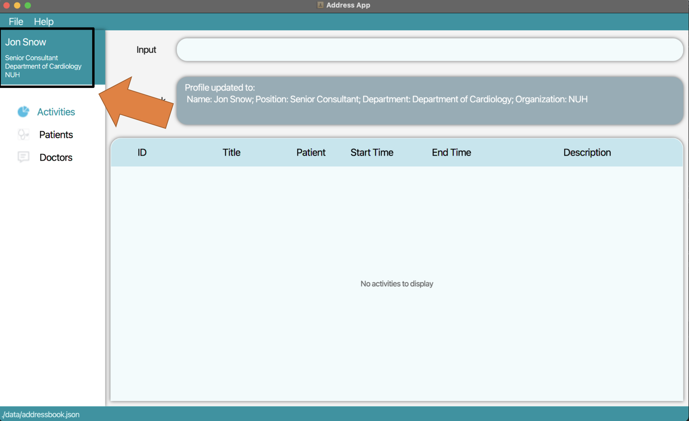

<div style="page-break-after: always;"></div>

### [3.5.3 Viewing help : `help`](#table-of-contents)

Shows a message giving a brief explanation of each command term, with its command format. 
Users can also copy a link to this user guide through the `help` command for more information. 

**Note:**

The in-app window just a basic guideline on how to use commands. Make use of the error messages from invalid commands, or follow
the link to the user guide, to get a better understanding of the commands.

Format: `help`

### [3.5.4 Clearing all entries : `clear`](#table-of-contents)

Clears all entries from the address book and resets the user profile to its default.

Format: `clear`

### [3.5.5 Exiting the program : `exit`](#table-of-contents)

Exits the program.

Format: `exit`

<div style="page-break-after: always;"></div>

# [**4. Tips and Tricks**](#table-of-contents)

## [4.1 Navigating Past Commands](#table-of-contents)

**GoMedic** is designed mainly for those who type fast and prefer inputting commands by typing them. 
However, typing commands repeatedly to fix small errors from previous commands can be frustrating. 

:bulb: **Tip:** You can navigate to your previous commands by pressing the up or down arrow keys!

Instead of typing the corrected command from scratch, you can press the up or down arrow keys to get the commands that you have entered previously, 
and modify them accordingly!

* The **up** arrow key allows you to go back to the previous command typed if any
* The **down** arrow key allows you to go forward to the next command typed if any 

If there are no more commands after the current command in the command box, **GoMedic** would clear the command box for you! 

**Examples:**

&#8291;1. Open the app and type `list t/patient` into the command box. The data shown in your table
might differ from the screenshots, depending on the data that is currently stored in your **GoMedic**.

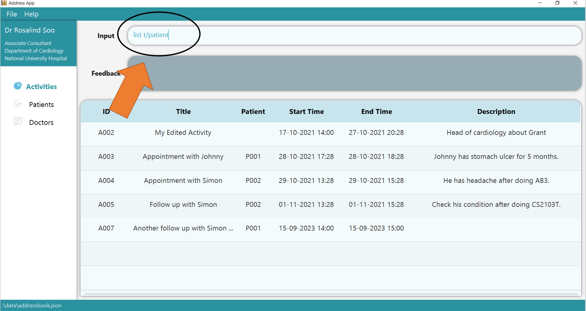

<div style="page-break-after: always;"></div>

&#8291;2. Press `Enter` and you would get the Patient table listed!

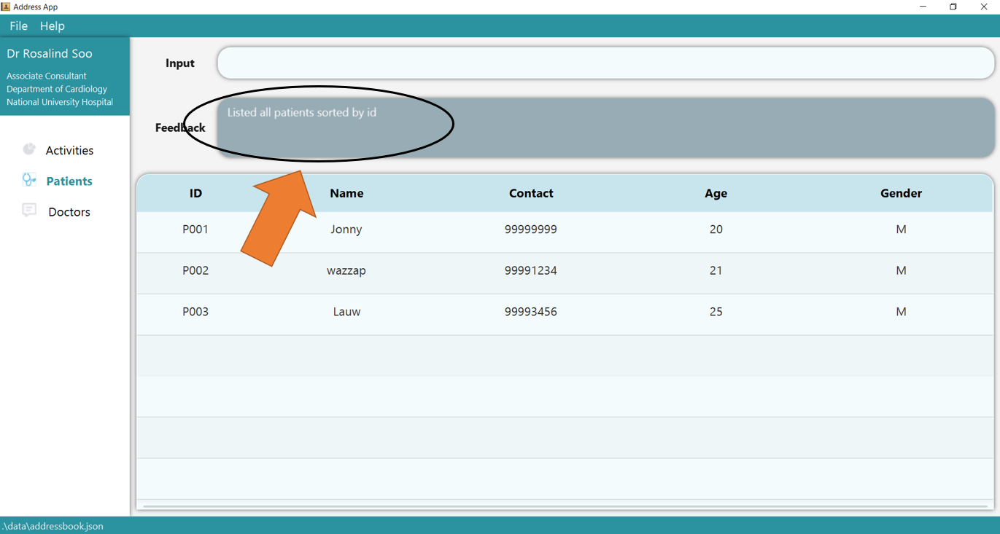

&#8291;3. To get the `list t/patient` command again, simply press **Up** arrow key in your keyboard, and you will get the `list t/patient` command
in your command box again!


<div style="page-break-after: always;"></div>

## [4.2 Suggestions](#table-of-contents)

There are two types of erroneous inputs that we are expecting; One for single worded commands and one for two word commands.
Behaviour of each erroneous command is assumed to follow the convention specified above.

* Any mention of `{command}` refers to one of these values `add`, `delete`, `list`, `edit`, `clear`, `find`, `view`, `help`,
  `profile`, `referral`, `help`, `exit`
* `{type}` indicates one of these three values `t/activity`,`t/patient`, `t/doctor` and `{type}_id` means `ACTIVITY_ID` for `{type} = t/activity`

There will be **up to 5** suggested commands for each erroneous input.

1. **For errors that follow the format `{misspelt command}`**

   * errors such as `exi` will return `exit`,`edit t/patient`,`edit t/doctor`,`edit t/activity` ranked using a word similarity metric.

   * for such errors, single word commands like `help` or two word commands like `add t/patient` may be suggested.

2. **For errors that follow the format `{command} {misspelt type}`, `{misspelt command} {type}` or `{misspelt command} {misspelt type}`:**

   * errors such as `adl t/patit` will return `add t/patient`, `add t/activity` ranked using a word similarity metric.

   * for such errors, only two word commands like `add t/patient` can be suggested.

## [4.3 Saving the data](#table-of-contents)

GoMedic saves the data on the hard disk automatically after every command. There is no need to save manually. Currently, all the data are saved as a JSON file `[JAR file location]/data/addressbook.json`.

## [4.4 Editing the data file](#table-of-contents)

**GoMedic** allows advanced users to update the data stored at `[JAR file location]/data/addressbook.json` directly by editing that data file.

<div markdown="span" class="alert alert-warning">:exclamation: **Caution:**
If your changes to the data file makes its format invalid, GoMedic will discard all data and start with an empty data file at the next run.
If the format for the user profile is invalid, the preset user profile will be used instead.
</div>

## [4.5 Reordering Columns in The Display Table](#table-of-contents)

:bulb: **Tip:** You can reorder the column to suit your preference by dragging the title, as shown by the following picture.

&#8291;1. Left click and hold any header of the table, the column would turn blue, indicating that it can be dragged.

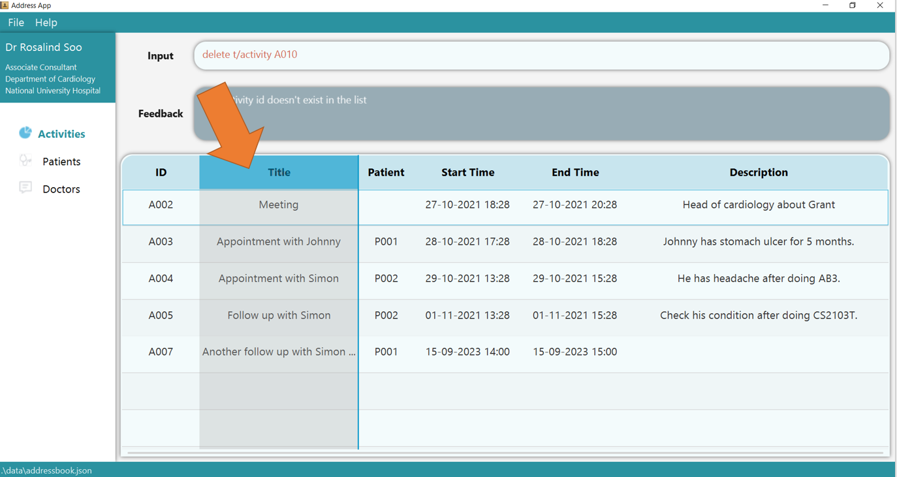

&#8291;2. Drag the header into the location of other columns as indicated as **1**, the column would be inserted at the line indicated by **2**.

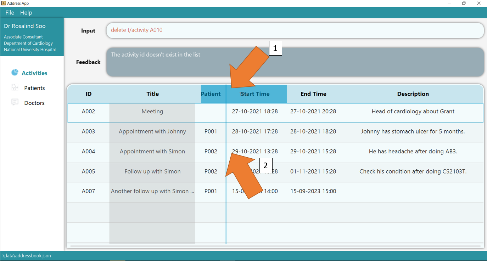

<div style="page-break-after: always;"></div>

&#8291;3. Release the left click, and the columns should be reordered now!

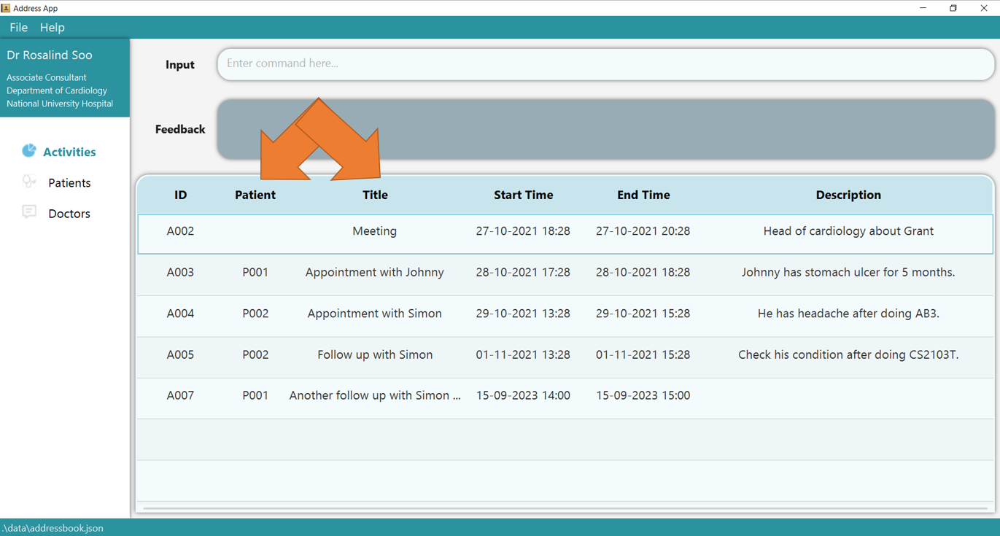

<div style="page-break-after: always;"></div>

# [**5. FAQ**](#table-of-contents)

**Q**: I can't double-click on the `gomedic.jar` file to open it. What should I do?<br>
**A**: Please check that you have Java `11` or above installed in your Computer by opening the terminal. You can do so by entering the command `java --version`. It should show `java 11.x.xx` or `openjdk 11.x.xx`, depending on the Java `11` distribution you are using.
Following that, enter the command `java -jar gomedic.jar` in the directory that `gomedic.jar` is resides in. Some precautions : 

2. For Windows user, please do not open it using Windows Subsystem Linux (WSL), please use Windows PowerShell to run `gomedic.jar`
3. For Mac users, you can follow the precautions stated [here](https://github.com/nus-cs2103-AY2122S1/forum/issues/353) to open your `jar` file.
4. If the aforementioned steps do not help you, please contact our developers directly by raising a new issue [here](https://github.com/AY2122S1-CS2103T-T15-1/tp/issues)!

--- 

**Q**: What are `config.json`, `preferences.json` and `addressbook.log` stored in `[JAR file location]/data/addressbook.json` ? <br>
**A**: `config.json` and `preferences.json` are programmable files that contains default settings that **GoMedic** uses such as the height and the width of the application, location to save the data, etc. Advanced users are welcome to edit it but 
please take note of these [precautions](#44-editing-the-data-file)! 

Meanwhile, `addressbook.log` is a text file containing messages for developers to fix some errors that the Users face. Should you want to raise a new issue about a new bug, you can always attach 
all the log files too so that we can help you find the root cause of the error faster!

--- 
**Q**: How do I transfer my data to another Computer?<br>
**A**: Install the app in the other computer and overwrite the empty `data` folder that it creates with the old `data` folder created by the old **GoMedic** application together with all the files within that `data` folder! 

<div style="page-break-after: always;"></div>

# [**6. Command summary**](#table-of-contents)

* `{PARAMETERS}` indicates the mandatory and optional parameters as specified in the [Features](#3-gomedic-features) section.
* `{type}` indicates one of these three values `t/activity`,`t/patient`, `t/doctor` and `{type}_id` means `ACTIVITY_ID` for `{type} = t/activity`

Action        | Format                                            | Examples                                             |                
--------------|---------------------------------------------------|----------------------------------------------------- |
**Add**       | `add {type} {PARAMETERS}`                         | `add t/doctor n/Timmy Tom p/98765432 de/neurology`   |
**Delete**    | `delete {type} {type}_ID`                         | `delete t/patient P003`                              |
**Edit**      | `edit {type} i/{type}_ID ...`                     | `edit t/patient i/P123 n/John Doe a/30 g/M`          |
**Find**      | `find {type} ...`                                 | `find ta/important ti/tutorial`                      |
**View**      | `view t/patient PATIENT_ID`                       | `view t/patient P003`                              |
**Referral**  | `referral {PARAMETERS}`                           | `referral ti/Referral of Patient A di/D001 pi/P001`  |
**Profile**   | `profile {PARAMETERS}`                            | `profile n/Jon Snow p/Senior Consultant de/Department of Cardiology o/NUH`|
**Clear**     | `clear` or `clear {type}`                         | `clear t/activity`                                   |
**List**      | `list {type} {PARAMETERS}`                        | `list t/patient`, `list t/activity s/START`          |
**Exit**      | `exit`                                            |                                                      |
**Help**      | `help`                                            |                                                      |

For additional tips and tricks such as past commands navigation and table columns reordering, please refer to [this](#4-tips-and-tricks) section!
