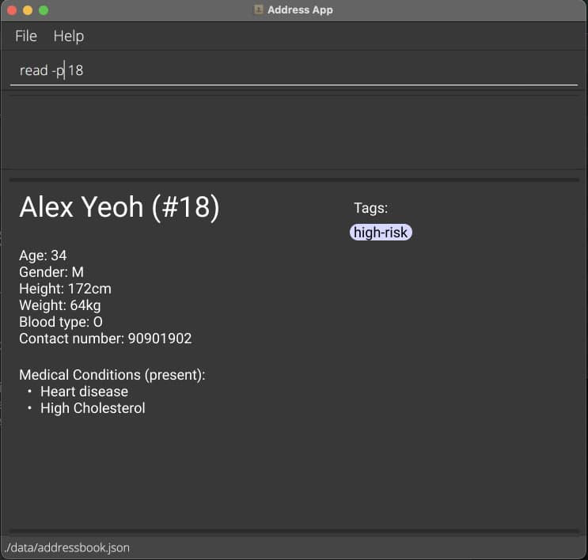

**GoMedic is a desktop application for managing your contact details.** While it has a GUI, most of the user
interactions happen using a CLI (Command Line Interface).

* If you are interested in using GoMedic, head over to the [_Quick Start_ section of the **User
  Guide**](UserGuide.html#quick-start).
* If you are interested about developing GoMedic, the [**Developer Guide**](DeveloperGuide.html) is a good place to
  start.

**Acknowledgements**

* Project bootstrapped from: [SE-EDU Address Book 3](https://se-education.org/addressbook-level3/)
* Libraries used: [JavaFX](https://openjfx.io/), [Jackson](https://github.com/FasterXML/jackson)
  , [JUnit5](https://github.com/junit-team/junit5), [iTextPdf](https://itextpdf.com/en)
* The feature `TableView` mainly inspired by [this `TableView` article](http://tutorials.jenkov.com/javafx/tableview.html).
